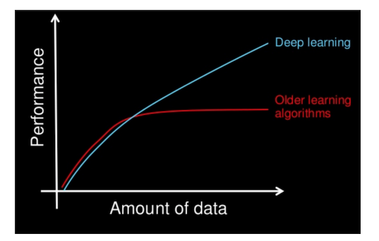

# 1.1 深度学习与机器学习的区别

## 学习目标

* 目标
  * 知道深度学习与机器学习的区别

* 应用
  * 无

## 1.1.1 区别

### 1.1.1.1 特征提取方面

* 机器学习的**特征工程步骤是要靠手动完成的，而且需要大量领域专业知识**
* 深度学习**通常由多个层组成，它们通常将更简单的模型组合在一起，通过将数据从一层传递到另一层来构建更复杂的模型。通过大量数据的训练自动得到模型，不需要人工设计特征提取环节**。

> 深度学习算法试图从数据中学习高级功能，这是深度学习的一个非常独特的部分。因此，减少了为每个问题开发新特征提取器的任务。**适合用在难提取特征的图像、语音、自然语言领域** 

### 1.1.1.2 数据量

机器学习需要的执行时间远少于深度学习，深度学习参数往往很庞大，需要通过大量数据的多次优化来训练参数。 

> 第一、它们需要大量的训练数据集
>
> 第二、是训练深度神经网络需要大量的算力
>
> 可能要花费数天、甚至数周的时间，才能使用数百万张图像的数据集训练出一个深度网络。所以以后
>
> * 需要强大对的GPU服务器来进行计算
> * 全面管理的分布式训练与预测服务——比如[谷歌 TensorFlow 云机器学习平台](https://cloud.google.com/ml/)——可能会解决这些问题，为大家提供成本合理的基于云的 CPU 和 GPU

### 1.1.2 算法代表

* 机器学习
  * 朴素贝叶斯、决策树等
* 深度学习
  * 神经网络