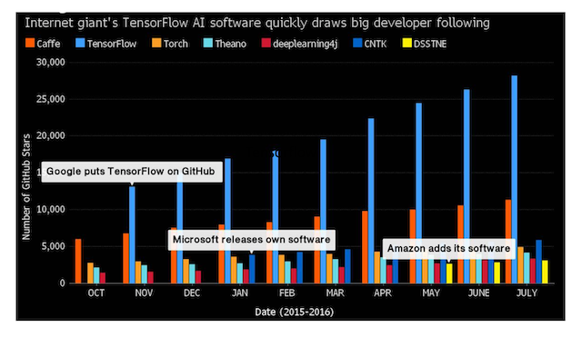
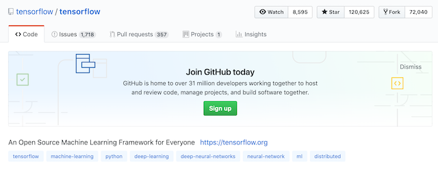

# 1.2 深度学习框架介绍

## 学习目标

- 目标
  - 了解常见的深度学习框架
  - 了解TensorFlow框架

- 应用
  - 无

## 1.2.1 常见深度学习框架对比



tensorflow的github：



## 1.2.2 TensorFlow的特点


官网：https://www.tensorflow.org/

* 语言多样（Language Options）

  * TensorFlow使用C++实现的，然后用Python封装。谷歌号召社区通过SWIG开发更多的语言接口来支持TensorFlow

* 使用分发策略进行分发训练

  * 对于大型 ML 训练任务，分发策略 API使在不更改模型定义的情况下，可以轻松地在不同的硬件配置上分发和训练模型。由于 TensorFlow 支持一系列硬件加速器，如 CPU、GPU 和 TPU

* Tensorboard可视化

  * TensorBoard是TensorFlow的一组Web应用，用来监控TensorFlow运行过程

* 在任何平台上的生产中进行强大的模型部署

  一旦您训练并保存了模型，就可以直接在应用程序中执行它，或者使用部署库为其提供服务：

  - [**TensorFlow 服务**](https://www.tensorflow.org/tfx/serving/)：允许模型通过 HTTP/REST 或 GRPC/协议缓冲区提供服务的 TensorFlow 库构建。
  - [**TensorFlow Lite**](https://www.tensorflow.org/mobile/tflite/)：TensorFlow 针对移动和嵌入式设备的轻量级解决方案提供了在 Android、iOS 和嵌入式系统上部署模型的能力。
  - [**tensorflow.js**](https://js.tensorflow.org/)：支持在 JavaScript 环境中部署模型，例如在 Web 浏览器或服务器端通过 Node.js 部署模型。TensorFlow.js 还支持在 JavaScript 中定义模型，并使用类似于 Kera 的 API 直接在 Web 浏览器中进行训练。

## 1.2.3 TensorFlow的安装

安装 TensorFlow在64 位系统上测试这些系统支持 TensorFlow：

- Ubuntu 16.04 或更高版本
- Windows 7 或更高版本
- macOS 10.12.6 (Sierra) 或更高版本（不支持 GPU）

进入虚拟环境当中再安装。刚开始的环境比较简单，只要下载tensorflow即可

- 环境包：

安装较慢，指定镜像源，请在带有numpy等库的虚拟环境中安装

- ubuntu安装

```
pip install tensorflow==1.12 -i https://mirrors.aliyun.com/pypi/simple
```

- MacOS安装

```
pip install tensorflow==1.12 -i https://mirrors.aliyun.com/pypi/simple
```

> 注：如果需要下载GPU版本的（TensorFlow只提供windows和linux版本的，没有Macos版本的）参考官网https://www.tensorflow.org/install/gpu?hl=zh-cn, 
>
> > 1、虚拟机下linux也是用不了GPU版本TensorFlow
> >
> > 2、本机单独的windows和本机单独的unbuntu可以使用GPU版本TensorFlow，需要安装相关驱动

### 1.2.4 Tenssorlfow使用技巧

* 使用**[ tf.keras](https://www.tensorflow.org/guide/keras) **构建、训练和验证您的模型，tf相关API用于损失计算修改等
* tensorflow提供模型训练模型部署