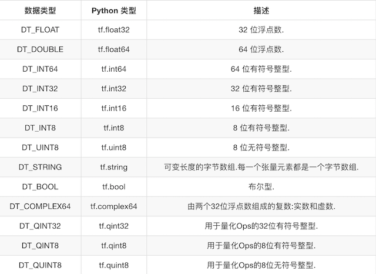
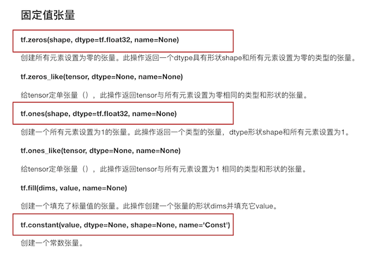
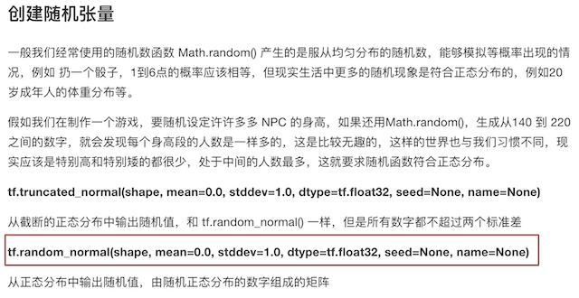
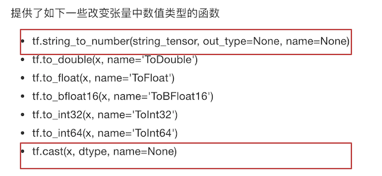

# 2.4 张量

## 学习目标

- 目标
  - 知道常见的TensorFlow创建张量
  - 知道常见的张量数学运算操作
  - 说明numpy的数组和张量相同性
  - 说明张量的两种形状改变特点
  - 应用set_shape和tf.reshape实现张量形状的修改
  - 应用tf.matmul实现张量的矩阵运算修改
  - 应用tf.cast实现张量的类型
- 应用
  - 无
- 内容预览
  - 2.4.1 张量(Tensor)
    - 1 张量的类型
    - 2 张量的阶
  - 2.4.2 创建张量的指令
    - 固定值张量
    - 随机值张量
  - 2.4.3 张量的变换
    - 1 类型改变
    - 2 形状改变
  - 2.4.4 张量的数学运算

在编写 TensorFlow 程序时，程序传递和运算的主要目标是tf.Tensor

## 2.4.1 张量(Tensor)

TensorFlow 的张量就是一个 n 维数组， 类型为tf.Tensor。Tensor具有以下两个重要的属性

* type:数据类型
* shape:形状(阶)

### 2.4.1.1 张量的类型



### 2.4.1.2 张量的阶


形状有0阶、1阶、2阶….

```python
tensor1 = tf.constant(4.0)
tensor2 = tf.constant([1, 2, 3, 4])
linear_squares = tf.constant([[4], [9], [16], [25]], dtype=tf.int32)

print(tensor1.shape)
# 0维：()   1维：(10, )   2维：(3, 4)   3维：(3, 4, 5)
```

## 2.4.2 创建张量的指令

* 固定值张量



* 随机值张量



* 其它特殊的创建张量的op
  * **tf.Variable**
  * tf.placeholder

## 2.4.3 张量的变换

### 1 类型改变



### 2 形状改变

TensorFlow的张量具有两种形状变换，动态形状和静态形状

* tf.reshape
* tf.set_shape

关于动态形状和静态形状必须符合以下规则

* 静态形状
  * 转换静态形状的时候，1-D到1-D，2-D到2-D，不能跨阶数改变形状
  * 对于已经固定的张量的静态形状的张量，不能再次设置静态形状
* 动态形状
  * tf.reshape()动态创建新张量时，张量的元素个数必须匹配

```python
def tensor_demo():
    """
    张量的介绍
    :return:
    """
    a = tf.constant(value=30.0, dtype=tf.float32, name="a")
    b = tf.constant([[1, 2], [3, 4]], dtype=tf.int32, name="b")
    a2 = tf.constant(value=30.0, dtype=tf.float32, name="a2")
    c = tf.placeholder(dtype=tf.float32, shape=[2, 3, 4], name="c")
    sum = tf.add(a, a2, name="my_add")
    print(a, a2, b, c)
    print(sum)
    # 获取张量属性
    print("a的图属性：\n", a.graph)
    print("b的名字：\n", b.name)
    print("a2的形状：\n", a2.shape)
    print("c的数据类型：\n", c.dtype)
    print("sum的op:\n", sum.op)

    # 获取静态形状
    print("b的静态形状：\n", b.get_shape())

    # 定义占位符
    a_p = tf.placeholder(dtype=tf.float32, shape=[None, None])
    b_p = tf.placeholder(dtype=tf.float32, shape=[None, 10])
    c_p = tf.placeholder(dtype=tf.float32, shape=[3, 2])
    # 获取静态形状
    print("a_p的静态形状为：\n", a_p.get_shape())
    print("b_p的静态形状为：\n", b_p.get_shape())
    print("c_p的静态形状为：\n", c_p.get_shape())

    # 形状更新
    # a_p.set_shape([2, 3])
    # 静态形状已经固定部分就不能修改了
    # b_p.set_shape([10, 3])
    # c_p.set_shape([2, 3])
    
    # 静态形状已经固定的部分包括它的阶数，如果阶数固定了，就不能跨阶更新形状
    # 如果想要跨阶改变形状，就要用动态形状
    # a_p.set_shape([1, 2, 3])
    # 获取静态形状
    print("a_p的静态形状为：\n", a_p.get_shape())
    print("b_p的静态形状为：\n", b_p.get_shape())
    print("c_p的静态形状为：\n", c_p.get_shape())

    # 动态形状
    # c_p_r = tf.reshape(c_p, [1, 2, 3])
    c_p_r = tf.reshape(c_p, [2, 3])
    # 动态形状，改变的时候，不能改变元素的总个数
    # c_p_r2 = tf.reshape(c_p, [3, 1])
    print("动态形状的结果：\n", c_p_r)
    # print("动态形状的结果2：\n", c_p_r2)
    return None
```

## 2.4.4 张量的数学运算

- 算术运算符
- 基本数学函数
- 矩阵运算
- reduce操作
- 序列索引操作

> 详细请参考: https://www.tensorflow.org/versions/r1.8/api_guides/python/math_ops
>
> 这些API使用，我们在使用的时候介绍，具体参考文档


