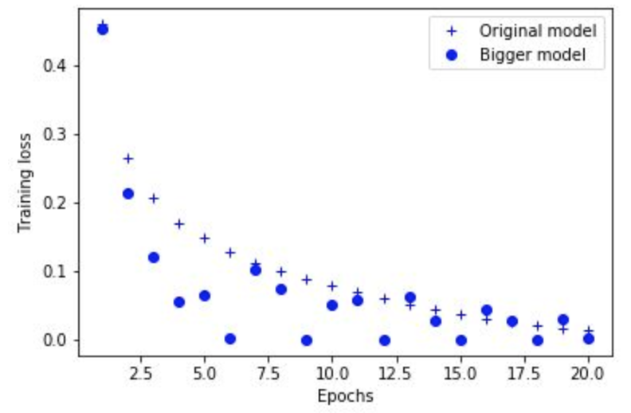
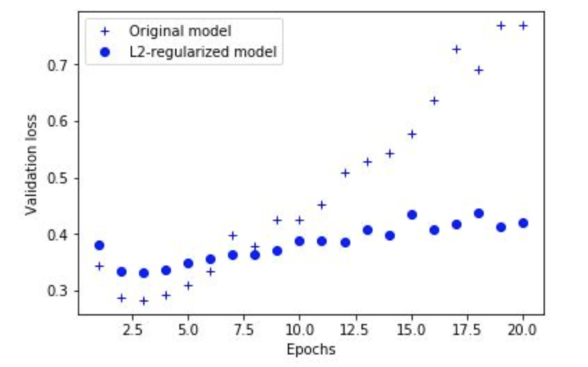
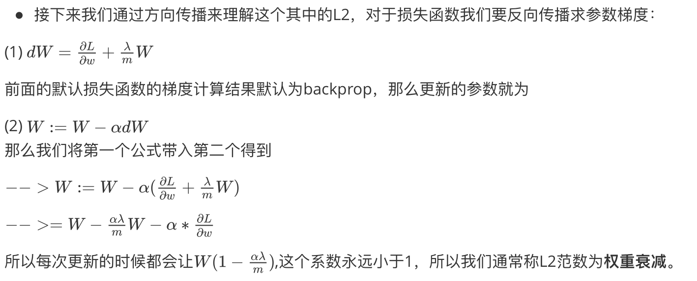
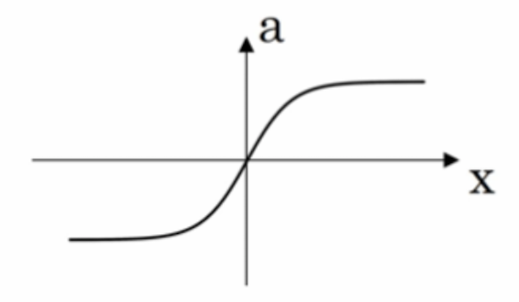
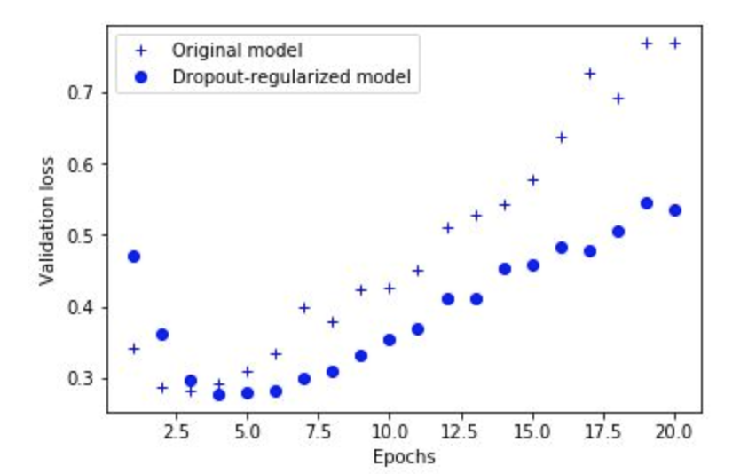
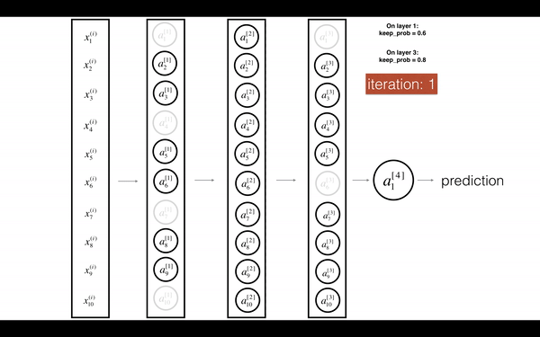

# 3.4 深度学习正则化

## 学习目标

- 目标
  - 了解偏差与方差的意义
  - 知道L2正则化与L1正则化的数学意义
  - 知道Droupout正则化的方法
  - 了解早停止法、数据增强法的其它正则化方式
- 应用
  - 无

### 3.4.1 偏差与方差

#### 3.4.1.1 数据集划分

首先我们对机器学习当中涉及到的数据集划分进行一个简单的复习

- 训练集（train set）：用训练集对算法或模型进行**训练**过程；
- 验证集（development set）：利用验证集（又称为简单交叉验证集，hold-out cross validation set）进行**交叉验证**，**选择出最好的模型**；
- 测试集（test set）：最后利用测试集对模型进行测试，对学习方法进行评估。

在**小数据量**的时代，如 100、1000、10000 的数据量大小，可以将数据集按照以下比例进行划分：

- 无验证集的情况：70% / 30%
- 有验证集的情况：60% / 20% / 20%

而在如今的**大数据时代**，拥有的数据集的规模可能是百万级别的，所以验证集和测试集所占的比重会趋向于变得更小。

- 100 万数据量：98% / 1% / 1%
- 超百万数据量：99.5% / 0.25% / 0.25%

以上这些比例可以根据数据集情况选择。

#### 3.4.1.2 偏差与方差的意义

**“偏差-方差分解”（bias-variance decomposition）**是解释学习算法泛化性能的一种重要工具。

泛化误差可分解为偏差、方差与噪声，**泛化性能**是由**学习算法的能力**、**数据的充分性**以及**学习任务本身的难度**所共同决定的。

- **偏差**：度量了学习算法的期望预测与真实结果的偏离程度，即刻画了**学习算法本身的拟合能力**
- **方差**：度量了同样大小的训练集的变动所导致的学习性能的变化，即刻画了**数据扰动所造成的影响**
- **噪声**：表达了在当前任务上任何学习算法所能够达到的期望**泛化误差的下界**，即刻画了**学习问题本身的难度**。

那么偏差、方差与我们的数据集划分到底有什么关系呢？

- 1、**训练集的错误率较小，而验证集/测试集的错误率较大**，**说明模型存在较大方差，可能出现了过拟合**
- 2、训练集和测试集的错误率都较大，且两者相近，**说明模型存在较大偏差，可能出现了欠拟合**
- 3、训练集和测试集的错误率都较小，且两者相近，说明方差和偏差都较小，这个模型效果比较好。

所以我们最终总结，**方差一般指的是数据模型得出来了，能不能对未知数据的扰动预测准确**。而**偏差说明在训练集当中就已经误差较大了，基本上在测试集中没有好的效果。**

所以如果我们的模型出现了较大的方差或者同时也有较大的偏差，该怎么去解决？

#### 3.4.1.3 解决方法

**对于高方差，有以下几种方式：**

- 获取更多的数据，使得训练能够包含所有可能出现的情况
- **正则化（Regularization）**
- 寻找更合适的网络结构

对于高偏差，有以下几种方式：

- 扩大网络规模，如添加隐藏层或者神经元数量
- 寻找合适的网络架构，使用更大的网络结构，如AlexNet
- 训练时间更长一些

不断尝试，直到找到低偏差、低方差的框架。

### 3.4.2 正则化(Regularization)

你可能熟悉奥卡姆剃刀原则：给出两个解释，最可能正确的解释是更简单的一个 – 假设较少的解释。 这个原则也适用于神经网络的模型： **简单的模型比复杂的泛化能力好**。

* 对于训练来说，加入正则化。显示了两个网络的训练集损失值随 epoch 的变化情况。更大的网络很快就会把训练集损失训练到接近零。 网络越大，训练数据学习的速度就越快（使训练损失很快降低），但是也更容易过拟合（导致训练和验证损失之间的巨大差异）。



* 对于验证集合来讲
  * 显示了 L2 正则化惩罚的影响。两个模型具有相同数量的参数，具有 L2 正则化的模型（点）也比参考模型（十字）更能减少过拟合。




**正则化**，**即在成本函数中加入一个正则化项(惩罚项)，惩罚模型的复杂度，防止网络过拟合**。

#### 3.4.2.1 逻辑回归的L1与L2正则化

逻辑回归的参数W数量根据特征的数量而定，那么正则化如下

- 逻辑回归的损失函数中增加L2正则化

$$J(w,b) = \frac{1}{m}\sum_{i=1}^mL(\hat{y}^{(i)},y^{(i)})+\frac{\lambda}{2m}{||w||}^2_2$$

其中的L2范数可以理解：$$\frac{\lambda}{2m}{||w||}^2_2=\frac{\lambda}{2m}\sum_{j=1}^{n_x}w^2_j = \frac{\lambda}{2m}w^Tw$$

**解释：所有w参数的平方和的结果**

- 逻辑回归的损失函数中增加L1正则化

$$J(w,b) = \frac{1}{m}\sum_{i=1}^mL(\hat{y}^{(i)},y^{(i)}) + \frac{\lambda}{2m}{||w||}_1$$

其中L2范数可以理解为：$$\frac{\lambda}{2m}{||w||}_1 = \frac{\lambda}{2m}\sum_{j=1}^{n_x}{|w_j|}$$

**注：其中，λ 为正则化因子，是超参数。由于 L1 正则化最后得到 w 向量中将存在大量的 0，使模型变得稀疏化，因此 L2 正则化更加常用。**

#### 3.4.2.2 正则化项的理解

在损失函数中增加一项，那么其实梯度下降是要减少损失函数的大小，对于L2或者L1来讲都是要去减少这个正则项的大小，那么也就是会减少W权重的大小。这是我们一个直观上的感受。



#### 3.4.2.3 正则化为什么能够防止过拟合

正则化因子设置的足够大的情况下，为了使成本函数最小化，权重矩阵 W 就会被设置为接近于 0 的值，**直观上**相当于消除了很多神经元的影响，那么大的神经网络就会变成一个较小的网络。



在加入正则化项后，当λ增大，导致$$W^[l]$$减小，$$Z^{[l]} = W^{[l]}a^{[l-1]} + b^{[l]}$$便会减小。由上图可知，在 z 较小（接近于 0）的区域里，函数近似线性，所以每层的函数就近似线性函数，整个网络就成为一个简单的近似线性的网络，因此不会发生过拟合。

#### 3.4.2.4 tf.keras正则化API

正则化器允许在优化过程中对层的参数或层的激活情况进行惩罚。

正则化器网络结构权重关键字参数：

- `kernel_regularizer`: `keras.regularizers.Regularizer` 的实例

* from tensorflow.python.keras import regularizers
* 可用的正则化器

```python
keras.regularizers.l1(0.01)
keras.regularizers.l2(0.01)
keras.regularizers.l1_l2(l1=0.01, l2=0.01)
```

### 3.4.3 Droupout正则化

* 验证集上面，训练迭代5次之后，在验证集合上面效果，dropout拟合效果要好



Droupout论文地址：http://jmlr.org/papers/volume15/srivastava14a.old/srivastava14a.pdf


Droupout：随机的对神经网络每一层进行丢弃部分神经元操作。


对于网络的每一层会进行设置保留概率，即keep_prob。假设keep_prob为0.8，那么也就是在每一层所有神经元有20% 的概率直接失效，可以理解为0.



#### 3.4.3.1 Inverted droupout

这种方式会对每层进行如下代码操作

```python
# 假设设置神经元保留概率
keep_prob = 0.8
# 随机建立一个标记1 or 0的矩阵，表示随机失活的单元，占比20%
dl = np.random.rand(al.shape[0], al.shape[1]) < keep_prob
# 让a1对应d1的为0地方结果为0
al = np.multiply(al, dl)
```

- 训练练的时候只有占比为$$p$$的隐藏层单元参与训练。

#### 3.4.3.2 droupout为什么有效总结

加入了 dropout 后，输入的特征都存在被随机清除的可能，所以该神经元不会再特别依赖于任何一个输入特征，也就是不会给任何一个输入特征设置太大的权重。通过传播过程，dropout 将产生和 L2 正则化相同的**收缩权重**的效果。

- 对于不同的层，设置的keep_prob大小也不一致，神经元较少的层，会设keep_prob为 1.0，而神经元多的层则会设置比较小的keep_prob
- 通常被使用在计算机视觉领域，图像拥有更多的特征，场景容易过拟合，效果被实验人员证明是很不错的。

调试时候使用技巧：

- dropout 的缺点是成本函数无法被明确定义，保证损失函数是单调下降的，确定网络没有问题，再次打开droupout才会有效。

#### 3.4.3.2 DroupoutAPI

* keras.layers.Dropout(0.2)
  * 指定丢失率

* 效果

```python
# 建立神经网络模型
    model = keras.Sequential([
        keras.layers.Flatten(input_shape=(28, 28)),  # 将输入数据的形状进行修改成神经网络要求的数据形状
        keras.layers.Dense(128, activation=tf.nn.relu),  # 定义隐藏层，128个神经元的网络层
        keras.layers.Dropout(0.2),
        keras.layers.Dense(10, activation=tf.nn.softmax)  # 10个类别的分类问题，输出神经元个数必须跟总类别数量相同
    ])
```

* 迭代10次的没有dropout效果

```python
60000/60000 [==============================] - 6s 103us/step - loss: 0.2627 - acc: 0.9035
0.3440319251060486 0.8739
```

* 迭代10词有dropout效果

```python
60000/60000 [==============================] - 6s 103us/step - loss: 0.2901 - acc: 0.8925
0.33530805484056475 0.8823
```

### 3.4.4 其它正则化方法

- 早停止法（Early Stopping）
- 数据增强

#### 3.4.4.1 早停止法（Early Stopping）

通常我们在训练验证的时候，发现过拟合。可以得到下面这张损失图


通常不断训练之后，损失越来越小。但是到了一定之后，模型学到的过于复杂（过于拟合训练集上的数据的特征）造成测试集开始损失较小，后来又变大。模型的w参数会越来越大，那么可以在测试集损失减小一定程度之后停止训练。

但是这种方法治标不治本，得从根本上解决数据或者网络的问题。

#### 3.4.4.2 数据增强

- 数据增强

指通过**剪切、旋转/反射/翻转变换、缩放变换、平移变换、尺度变换、对比度变换、噪声扰动、颜色变换**等一种或多种组合数据增强变换的方式**来增加数据集的大小**。


即使卷积神经网络被放在不同方向上，卷积神经网络对平移、视角、尺寸或照度（或以上组合）保持不变性，都会认为是一个物体。

- 为什么这样做？


假设数据集中的两个类。左边的代表品牌A（福特），右边的代表品牌B（雪佛兰）。

假设完成了训练，并且输入下面的图像（品牌A），但是你的神经网络输出认为它是品牌B的汽车！


为什么会发生这种现象? 因为算法可能会寻找区分一个类和另一个类的最明显特征。在这个例子中 ，这个特征就是所有品牌A的汽车朝向左边，所有品牌B的汽车朝向右边。神经网络的好坏取决于输入的数据。

怎么解决这个问题？

我们需要减少数据集中不相关特征的数量。对上面的汽车类型分类器来说，你只需要将现有的数据集中的照片水平翻转，使汽车朝向另一侧。现在，用新的数据集训练神经网络，通过过增强数据集，可以防止神经网络学习到不相关的模式，提升效果。（在没有采集更多的图片前提下）

- 数据增强类别

那么我们应该在机器学习过程中的什么位置进行数据增强？在向模型输入数据之前增强数据集。

- 离线增强。预先进行所有必要的变换，从根本上增加数据集的规模（例如，通过翻转所有图像，保存后数据集数量会增加2倍）。
- 在线增强，或称为动态增强。可通过对即将输入模型的小批量数据的执行相应的变化，这样同一张图片每次训练被随机执行一些变化操作，相当于不同的数据集了。

那么我们的代码中也是进行这种在线增强。

- 数据增强技术

下面一些方法基础但功能强大的增强技术，目前被广泛应用。

- 翻转：tf.image.random_flip_left_right
  - 你可以水平或垂直翻转图像。一些架构并不支持垂直翻转图像。但，垂直翻转等价于将图片旋转180再水平翻转。下面就是图像翻转的例子。


```
				  从左侧开始分别是：原始图像，水平翻转图像，垂直翻转图像
```

- 旋转:rotate


```
                                      从左到右，图像相对于前一个图像顺时针旋转90度
```

- 剪裁：random_crop
  - 随机从原始图像中采样一部分，然后将这部分图像调整为原始图像大小。这个方法更流行的叫法是随机裁剪。


```
				 从左侧开始分别为：原始图像，从左上角裁剪出一个正方形部分，然后从右下角裁剪出一个正方形部分。剪裁的部分被调整为原始图像大小。
```

- 平移、缩放等等方法

数据增强的效果是非常好的，比如下面的例子，绿色和粉色表示没有数据增强之前的损失和准确率效果，红色和蓝色表示数据增强之后的损失和准确率结果，可以看到学习效果也改善较快。


那么TensorFlow 官方源码都是基于 vgg与inception论文的图像增强介绍，全部通过tf.image相关API来预处理图像。并且提供了各种封装过tf.image之后的API。那么TensorFlow 官网也给我们提供了一些模型的数据增强过程。

### 3.3.5 总结

- 掌握偏差与方差的意义
- 掌握L2正则化与L1正则化的数学原理
  - 权重衰减
- 掌握droupout原理以及方法
  - Inverted droupout
- 知道正则化的作用


