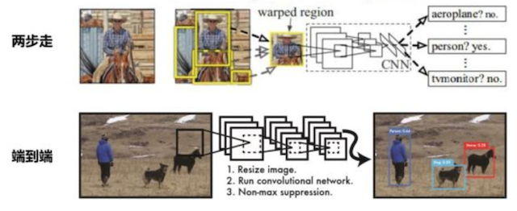
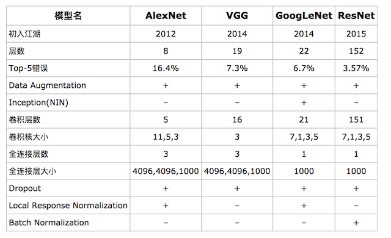
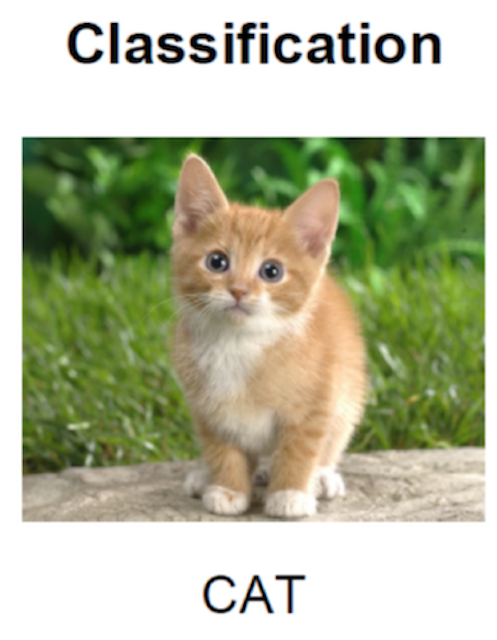
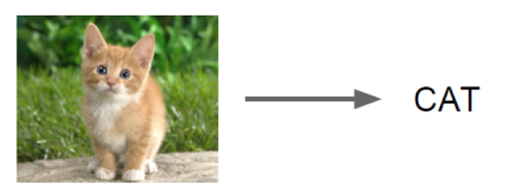
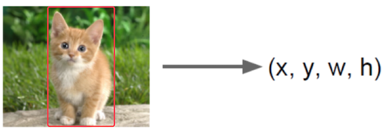
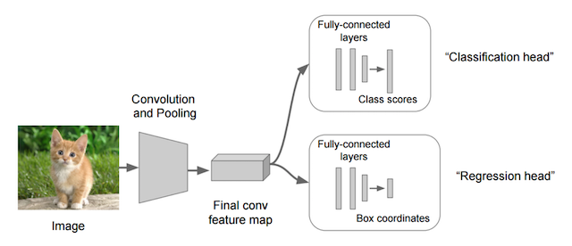
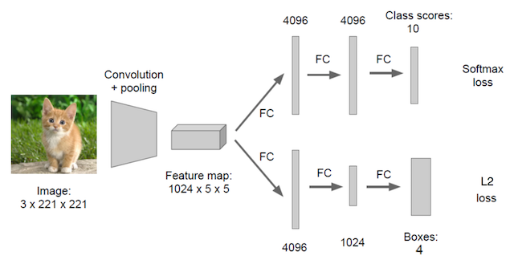

# 4.2 目标检测任务描述

### 学习目标

- 目标
  - 了解目标检测算法分类
  - 知道目标检测的常见指标IoU
  - 了解目标定位的简单实现方式
- 应用

  - 无

### 4.2.1 目标检测算法分类

* 两步走的目标检测：先进行区域推荐，而后进行目标分类
  * 代表：R-CNN、SPP-net、Fast R-CNN、Faster R-CNN

* 端到端的目标检测：采用一个网络一步到位
  * 代表：YOLO、SSD

### 4.2.2 目标检测的任务

#### 4.2.2.1 分类原理回顾

先来回归下分类的原理，这是一个常见的CNN组成图，输入一张图片，经过其中卷积、激活、池化相关层，最后加入全连接层达到分类概率的效果

* 分类的损失与优化

在训练的时候需要计算每个样本的损失，那么CNN做分类的时候使用**softmax函数计算结果，损失为交叉熵损失**

* 常见CNN模型

**对于目标检测来说不仅仅是分类这样简单的一个图片输出一个结果，而且还需要输出图片中目标的位置信息，所以从分类到检测，如下图标记了过程:**

* 分类

* 目标检测

#### 4.2.2.2 检测的任务

* 分类：
  * N个类别
  * 输入：图片
  * 输出：类别标签
  * 评估指标：Accuracy

* 定位：
  * N个类别
  * 输入：图片
  * 输出：物体的位置坐标
  * **主要评估指标：IOU**

其中我们得出来的(x,y,w,h)有一个专业的名词，叫做bounding box(bbox).

* 物体位置：
  * x, y, w,h:x,y物体的中心点位置，以及中心点距离物体两边的长宽
  * xmin, ymin, xmax, ymax：物体位置的左上角、右下角坐标

### 4.2.3  目标定位的简单实现思路

在分类的时候我们直接输出各个类别的概率，如果再加上定位的话，我们可以考虑在网络的最后输出加上位置信息。

#### 4.2.3.1 回归位置

增加一个全连接层，即为FC1、FC2

* FC1：作为类别的输出

* FC2：作为这个物体位置数值的输出

假设有10个类别，输出[p1,p2,p3,...,p10]，然后输出这一个对象的四个位置信息[x,y,w,h]。同理知道要网络输出什么，如果衡量整个网络的损失

* 对于分类的概率，还是使用**交叉熵损失**
* 位置信息具体的数值，**可使用MSE均方误差损失（L2损失）**

如下图所示

#### 4.2.4.1 两种Bounding box名称

在目标检测当中，对bbox主要由两种类别。

- Ground-truth bounding box：图片当中真实标记的框
- Predicted bounding box：预测的时候标记的框

一般在目标检测当中，我们预测的框有可能很多个，真实框GT也有很多个。

### 4.2.5 总结

* 掌握目标检测的算法分类
* 掌握分类，分类与定位，目标检测的区别
* 掌握分类与定位的简单方法、损失衡量

### 
