# 4.3 R-CNN

### 学习目标

- 目标

  - 了解Overfeat模型的移动窗口方法
  - 说明R-CNN的完整结构过程
  - 了解选择性搜索
  - 了解Crop+Warp的作用
  - 知道NMS的过程以及作用
  - 了解候选区域修正过程
  - 说明R-CNN的训练过程
  - 说明R-CNN的缺点

- 应用

  - 无

对于一张图片当中多个目标，多个类别的时候。前面的输出结果是不定的，有可能是以下有四个类别输出这种情况。或者N个结果，这样的话，网络模型输出结构不定

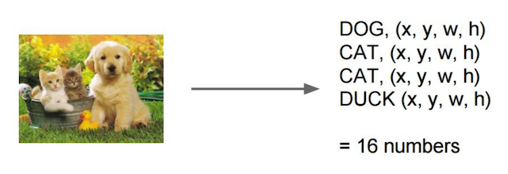

所以需要一些他的方法解决目标检测（多个目标）的问题，试图将一个检测问题简化成分类问题

### 4.3.1 目标检测-Overfeat模型

#### 4.3.1.1 滑动窗口

* 目标检测的暴力方法是从左到右、从上到下滑动窗口，利用分类识别目标。
  * 为了在不同观察距离处检测不同的目标类型，我们使用不同大小和宽高比的窗口。如下图所示：

注：这样就变成每张子图片输出类别以及位置，变成分类问题。

但是滑动窗口需要初始设定一个固定大小的窗口，这就遇到了一个问题，有些物体适应的框不一样

* 所以需要提前设定**K个窗口，每个窗口滑动提取M个，总共K x M 个图片**，通常会直接将图像变形转换成固定大小的图像，变形图像块被输入 CNN 分类器中，提取特征后，我们使用一些分类器识别类别和该边界框的另一个线性回归器。

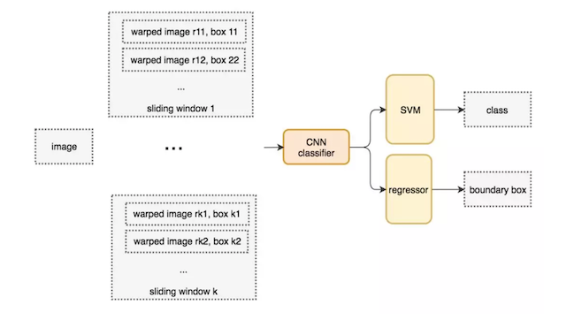

#### 4.3.1.2 Overfeat模型总结

这种方法类似一种暴力穷举的方式，会消耗大量的计算力量，并且由于窗口大小问题可能会造成效果不准确

。但是提供了一种解决目标检测问题的思路

### 4.3.2 目标检测-R-CNN模型

在CVPR 2014年中Ross Girshick提出R-CNN。

#### 4.3.2.1 完整R-CNN结构

不使用暴力方法，而是用候选区域方法（region proposal method）,创建目标检测的区域改变了图像领域实现物体检测的模型思路，R-CNN是以深度神经网络为基础的物体检测的模型 ，R-CNN在当时以优异的性能令世人瞩目，以R-CNN为基点，后续的SPPNet、Fast R-CNN、Faster R-CNN模型都是照着这个物体检测思路。

* 步骤（以AlexNet网络为基准）
  * **1.找出图片中可能存在目标的侯选区域region proposal**
  * **2.将候选区域调整为了适应AlexNet网络的输入图像的大小227×227，通过CNN对候选区域提取特征向量，2000个建议框的CNN特征组合成网络AlexNet最终输出：2000×4096维矩阵**
  * **3.将2000×4096维特征经过SVM分类器(20种分类，SVM是二分类器，则有20个SVM)，获得2000×20种类别矩阵**
  * **4.分别对2000×20维矩阵中进行非极大值抑制（NMS:non-maximum suppression）剔除重叠建议框，得到与目标物体最高的一些建议框**
  * **5.修正bbox，对bbox做回归微调**

#### 4.3.2.2 候选区域（Region of Interest）得出（了解）

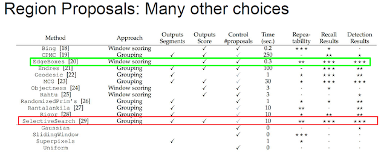

**选择性搜索（SelectiveSearch，SS）中**，首先将每个像素作为一组。然后，计算每一组的纹理，并将两个最接近的组结合起来。但是为了避免单个区域吞噬其他区域，我们首先对较小的组进行分组。我们继续合并区域，直到所有区域都结合在一起。下图第一行展示了如何使区域增长，第二行中的蓝色矩形代表合并过程中所有可能的 ROI。

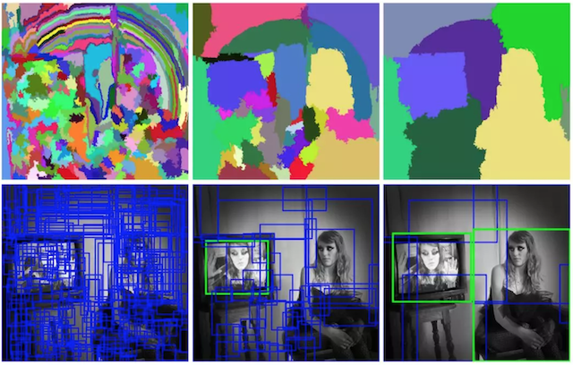

SelectiveSearch在一张图片上提取出来约2000个侯选区域，**需要注意的是这些候选区域的长宽不固定**。 而使用CNN提取候选区域的特征向量，需要接受固定长度的输入，所以需要对候选区域做一些尺寸上的修改。

#### 4.3.2.3 CNN网络提取特征

在侯选区域的基础上提取出更高级、更抽象的特征，这些高级特征是作为下一步的分类器、回归的输入数据。

提取的这些特征将会保存在磁盘当中（**这些提取的特征才是真正的要训练的数据**）

#### 4.3.2.4 特征向量训练分类器SVM

* 1、假设一张图片的2000个侯选区域，那么提取出来的就是2000 x 4096这样的特征向量（R-CNN当中默认CNN层输出4096特征向量）。
* **2、R-CNN选用SVM进行二分类。假设检测20个类别，那么会提供20个不同类别的SVM分类器，每个分类器都会对2000个候选区域的特征向量分别判断一次，这样得出[2000, 20]的得分矩阵，如下图所示**

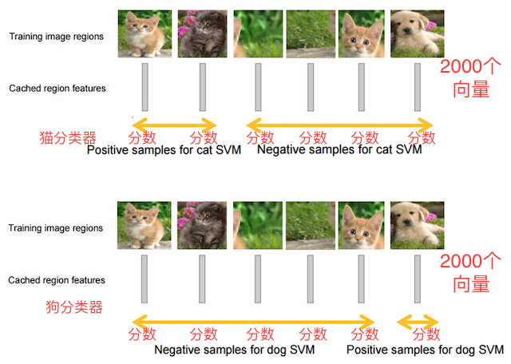

* 每个SVM分类器做的事情
  * 判断2000个候选区域是**某类别，还是背景**

#### 4.3.2.5 非最大抑制（NMS）

* 目的
  * **筛选候选区域，目标是一个物体只保留一个最优的框，来抑制那些冗余的候选框**
* 迭代过程
  * 1、对于所有的2000个候选区域得分进行概率筛选，0.5
  * 2、剩余的候选框
    * 假设图片真实物体个数为2（N），筛选之后候选框为5（P），计算N中每个物体位置与所有P的交并比IoU计算，得到P中每个候选框对应IoU最高的N中一个
    * 如下图，A、C候选框对应左边车辆，B、D、E对应右边车辆

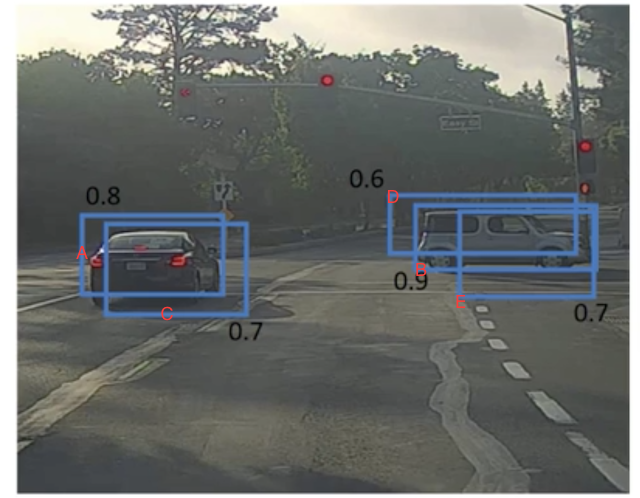

假设现在滑动窗口有：A、B、C、D、E 5个候选框，

* 第一轮：对于右边车辆，假设B是得分最高的，与B的IoU＞0.5删除。现在与B计算IoU，DE结果＞0.5，剔除DE，B作为一个预测结果
* 第二轮：对于左边车辆，AC中，A的得分最高，与A计算IoU，C的结果＞0.5，剔除C，A作为一个结果

最终结果为在这个5个中检测出了两个目标为A和B

**SS算法得到的物体位置已经固定了，但是我们筛选出的位置不一定真的就特别准确，需要对A和B进行最后的修正**

#### 4.3.2.6 修正候选区域

那么通过非最大一直筛选出来的候选框不一定就非常准确怎么办？R-CNN提供了这样的方法，建立一个bbox regressor

* **回归用于修正筛选后的候选区域，使之回归于ground-truth，默认认为这两个框之间是线性关系，因为在最后筛选出来的候选区域和ground-truth很接近了**

修正过程（线性回归）

- 给定：anchor  和 ![GT=[G_{x}, G_{y}, G_{w}, G_{h}]](https://www.zhihu.com/equation?tex=GT%3D%5BG_%7Bx%7D%2C+G_%7By%7D%2C+G_%7Bw%7D%2C+G_%7Bh%7D%5D)
- 寻找一种变换**F，**使得：，其中

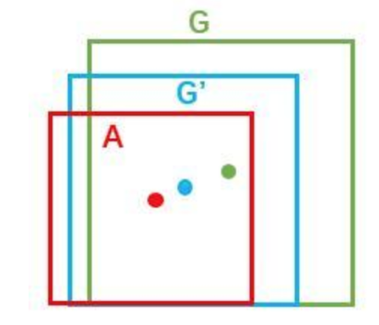

### 4.3.3 检测的评价指标

#### 4.3.3.1 IoU交并比

| 任务                                               | description                                            | 输入         | 输出                                          | 评价标准                      |
| -------------------------------------------------- | ------------------------------------------------------ | ------------ | --------------------------------------------- | ----------------------------- |
| Detection     and     Localization    (检测和定位) | 在输入图片中找出存在的物体类别和位置(可能存在多种物体) | 图片(image ) | 类别标签(categories)和    位置(bbox(x,y,w,h)) | IoU (Intersection over Union) |

- IoU（交并比）
  - 两个区域的重叠程度overlap：侯选区域和标定区域的IoU值

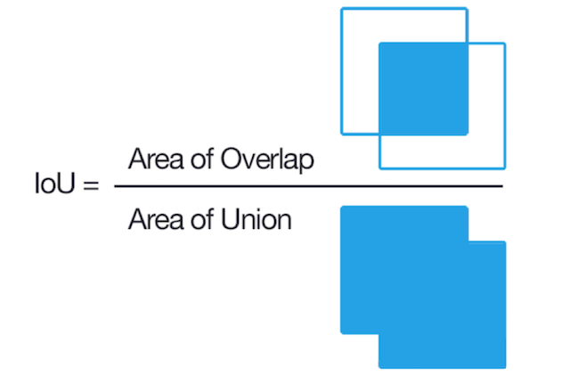

* 通常Correct: 类别正确 且 IoU > 0.5

#### 4.3.3.1 平均精确率（mean average precision）map

训练样本的标记：候选框（如RCNN2000个）标记

- 1.每个ground-truth box有着最高的IoU的anchor标记为正样本
- 2.剩下的anchor/anchors与任何ground-truth box的IoU大于0.7记为正样本，IoU小于0.3，记为负样本

* 定义：多个分类任务的AP的平均值
  * mAP = 所有类别的AP之和 / 类别的总个数
  * 注:`PR曲线`，而AP（average precision）就是这个曲线下的面积(ROC与AUC)
* 方法步骤：
  * 1、对于其中一个类别C，首先将算法输出的所有C类别的预测框，按预测的分数confidence排序
    * RCNN中就是SVM的输出分数
  * 2、设定不同的k值，选择top k个预测框，计算FP和TP，计算Precision和AP 
  * 3、将得到的N个类别的AP取平均，即得到AP；AP是针对单一类别的，mAP是将所有类别的AP求和，再取平均：

* 首先回顾精确率与召回率
  * 左边一整个矩形中的数表示ground truth之中为1的（即为正确的）数据
  * 右边一整个矩形中的数表示ground truth之中为0的数据
  * 精度precision的计算是用 检测正确的数据个数/总的检测个数
  * 召回率recall的计算是用 检测正确的数据个数/ground truth之中所有正数据个数。

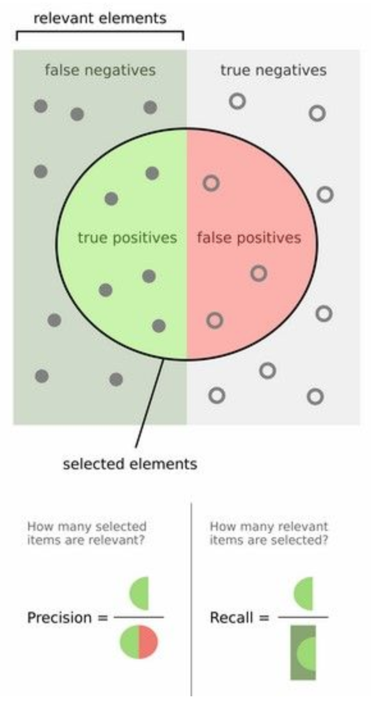

### 4.3.4 R-CNN总结

#### 4.3.4.1 流程总结

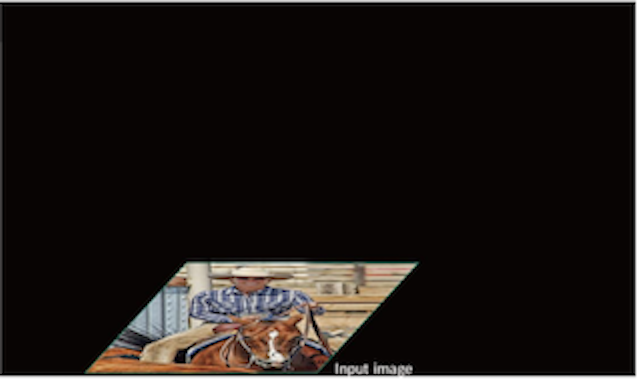

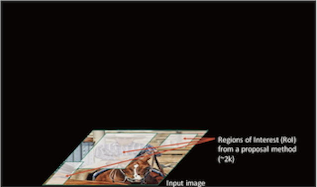

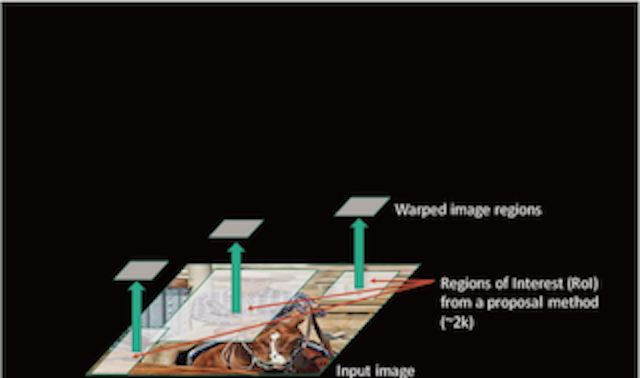

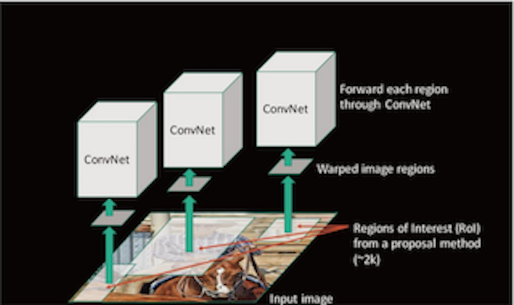

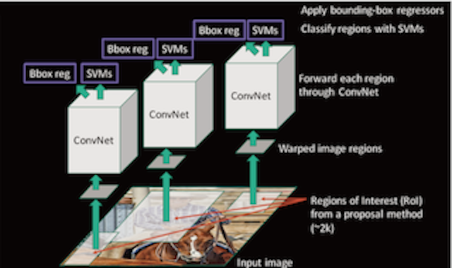

* 表现
  * **在VOC2007数据集上的平均精度map达到66%**

#### 4.3.4.2 缺点

* 1、训练阶段多：步骤繁琐: 微调网络+训练SVM+训练边框回归器。

* 2、训练耗时：占用磁盘空间大：5000张图像产生几百G的特征文件。（VOC数据集的检测结果，因为SVM的存在）

* 3、处理速度慢: 使用GPU, **VGG16模型处理一张图像需要47s**。
* 4、图片形状变化：候选区域要经过crop/warp进行固定大小，无法保证图片不变形

### 4.3.6 总结

* 掌握Overfeat模型思路
  * 滑动窗口
* 掌握R-CNN的流程
* 了解R-CNN的缺点
  * 训练耗时
  * 训练阶段多
  * 处理速度慢
  * 图片变形问题

### 4.3.7 问题？

1、NMS的过程描述？以及作用？

2、请说明候选框的修正过程？

3、IoU以及map计算过程

## 4.3.8 改进-SPPNet

### 学习目标

- 目标
  - 说明SPPNet的特点
  - 说明SPP层的作用
- 应用
  - 无

R-CNN的速度慢在哪？

每个候选区域都进行了卷积操作提取特征。

### 3.3.1 SPPNet

SPPNet主要存在两点改进地方，提出了SPP层

- 减少卷积计算

| R-CNN模型                                                    | SPPNet模型                                                   |
| ------------------------------------------------------------ | ------------------------------------------------------------ |
| 1、R-CNN是让每个候选区域经过crop/wrap等操作变换成固定大小的图像                2、固定大小的图像塞给CNN     传给后面的层做训练回归分类操作 | 1、SPPNet把全图塞给CNN得到全图的feature map       2、**让SS得到候选区域直接映射特征向量中对应位置**        3、映射过来的特征向量，**经过SPP层(空间金字塔变换层)**，S输出固定大小的特征向量给FC层 |

#### 3.3.1.1 映射

原始图片经过CNN变成了feature map,原始图片通过选择性搜索（SS）得到了候选区域（Region of Interest），现在需要将基于原始图片的候选区域映射到feature map中的特征向量。映射过程图参考如下：

整个映射过程有具体的公式，如下

假设(x′,y′)(x′,y′)表示特征图上的坐标点，坐标点(x,y)表示原输入图片上的点，那么它们之间有如下转换关系，这种映射关心与网络结构有关：(x,y)=(S∗x′,S∗y′)，即

- 左上角的点：
  - **x′=[x/S]+1**
- 右下角的点：
  - **x′=[x/S]−1**

其中 S 就是CNN中**所有的strides的乘积**，包含了池化、卷积的stride。论文中使用S的计算出来为2x2x2x2=16

> 拓展：如果关注这个公式怎么计算出来，请参考：http://kaiminghe.com/iccv15tutorial/iccv2015_tutorial_convolutional_feature_maps_kaiminghe.pdf

#### 3.3.1.2 spatial pyramid pooling

* **通过spatial pyramid pooling 将特征图转换成固定大小的特征向量**

示例：假设原图输入是224x224，对于conv出来后的输出是13x13x256，其中某个映射的候选区域假设为：12x10x256

* spp layer会将每**一个候选区域分成1x1，2x2，4x4三张子图，对每个子图的每个区域作max pooling**，得出的特征再连接到一起就是(16+4+1)x256=21x256=5376结果,接着给全连接层做进一步处理，如下图：
* Spatial bins（空间盒个数）：1+4+16=21

### 3.3.2 SPPNet总结

来看下SPPNet的完整结构

- 优点
  - SPPNet在R-CNN的基础上提出了改进，通过候选区域和feature map的映射，配合SPP层的使用，从而达到了CNN层的共享计算，减少了运算时间， 后面的Fast R-CNN等也是受SPPNet的启发
- 缺点
  - 训练依然过慢、效率低，特征需要写入磁盘(因为SVM的存在)
  - 分阶段训练网络：选取候选区域、训练CNN、训练SVM、训练bbox回归器, SPPNet反向传播效率低

### 3.3.3 总结

- 掌握SPP的池化作用
- 掌握SPP的优缺点

### 3.3.4 问题？

1、SPPNet的映射过程描述？公式？

2、spatial pyramid pooling的过程？

3、SPPNet相对于R-CNN的改进地方？

