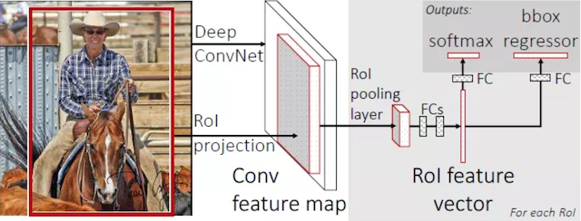
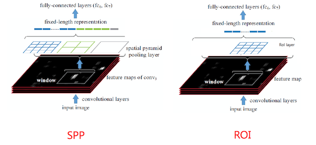
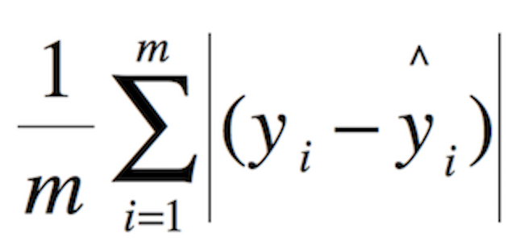
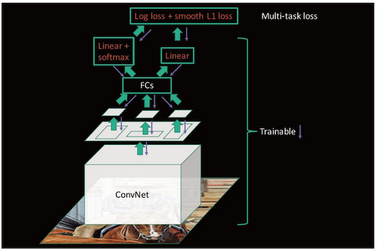

# 4.4 Fast R-CNN

### 学习目标

- 目标

  - 了解Fast R-CNN的结构特点
  - 说明RoI pooling的特点
  - 了解多任务损失

- 应用

  - 无

SPPNet的性能已经得到很大的改善，但是由于网络之间不统一训练，造成很大的麻烦，所以接下来的Fast R-CNN就是为了解决这样的问题

### 4.4.1 Fast R-CNN

改进的地方：

* 提出一个RoI pooling，然后整合整个模型，把CNN、RoIpooling、分类器、bbox回归几个模块整个一起训练

* 步骤
  * 首先将整个图片输入到一个基础卷积网络，得到整张图的feature map
  * 将选择性搜索算法的结果region proposal（RoI）映射到feature map中
  * RoI pooling layer提取一个**固定长度**的特征向量，每个特征会输入到一系列全连接层，得到一个RoI特征向量**（此步骤是对每一个候选区域都会进行同样的操作）**
    - 其中一个是传统softmax层进行分类，输出类别有K个类别加上”背景”类
    - 另一个是bounding box regressor

#### 4.4.1.1 RoI pooling

首先RoI pooling只是一个简单版本的SPP，目的是为了减少计算时间并且得出固定长度的向量。

- RoI池层使用最大池化将任何有效的RoI区域内的特征转换成具有H×W的固定空间范围的小feature map，其中H和W是**超参数** 它们独立于任何特定的RoI。

为什么要设计单个尺度呢？这要涉及到**single scale与multi scale**两者的优缺点

- single scale，直接将image定为某种scale，直接输入网络来训练即可。（Fast R-CNN）
- multi scal，也就是要生成一个金字塔

**后者比前者更加准确些，没有突更多，但是第一种时间要省很多，所以实际采用的是第一个策略，因此Fast R-CNN要比SPPNet快很多也是因为这里的原因。**

#### 4.4.1.2 End-to-End model

从输入端到输出端直接用一个神经网络相连，整体优化目标函数。

#### 接着我们来看为什么后面的整个网络能进行统一训练？

特征提取**CNN**的训练和**SVM分类器**的训练在时间上是先后顺序，两者的训练方式**独立**，因此SVMs的训练Loss无法更新SPP-Layer之前的卷积层参数，去掉了SVM分类这一过程，所有特征都存储在内存中，不占用硬盘空间，形成了**End-to-End模型**（proposal除外，end-to-end在Faster-RCNN中得以完善）

* 使用了softmax分类

### 4.4.2 多任务损失-Multi-task loss

两个loss，分别是：

- 对于分类loss，是一个N+1路的softmax输出，其中的N是类别个数，1是背景，**使用交叉熵损失**
- 对于回归loss，是一个4xN路输出的regressor，也就是说对于每个类别都会训练一个单独的regressor的意思，**使用平均绝对误差（MAE）损失即L1损失**

* fine-tuning训练:
  * 在微调时，调整 CNN+RoI pooling+softmax
  * 调整bbox regressor回归当中的参数

### 4.4.3 R-CNN、SPPNet、Fast R-CNN效果对比

|     参数      | R-CNN | SPPNet | Fast R-CNN |
| :-----------: | :---: | :----: | :--------: |
|  训练时间(h)  |  84   |   25   |  **9.5**   |
| 测试时间/图片 | 47.0s |  2.3s  | **0.32s**  |
|      mAP      | 66.0  |  63.1  |  **66.9**  |

### 4.4.4 Fast R-CNN总结

* 缺点
  * 使用Selective Search提取Region Proposals，没有实现真正意义上的端对端，**操作也十分耗时**

### 4.4.5 总结

* 掌握Fast R-CNN的改进
* 掌握RoI pooling的作用
* 掌握多任务损失结构

### 4.4.6 问题？

1、详细说明RoI pooling过程？

2、Fast R-CNN的损失是怎么样的？