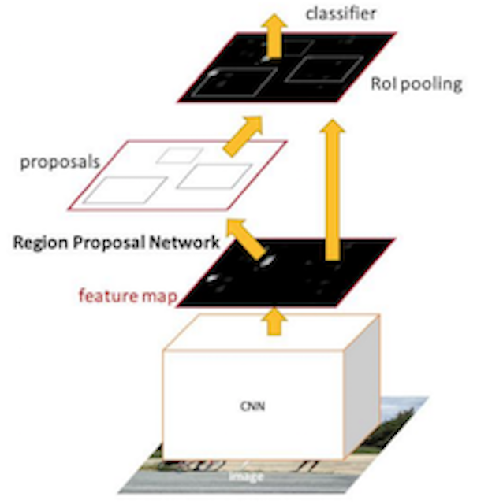
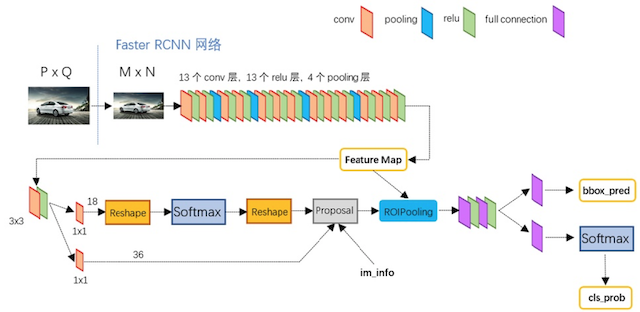
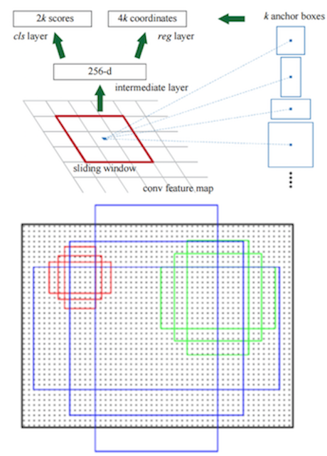
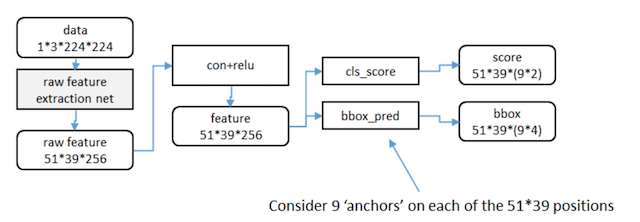
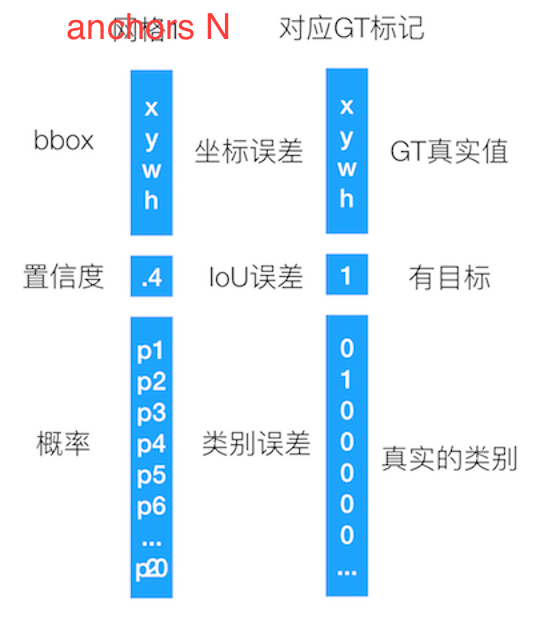
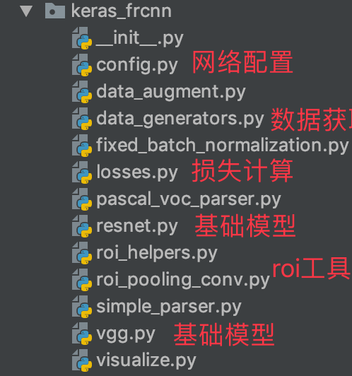

# 4.5 Faster R-CNN

### 学习目标

- 目标

  - 了解Faster R-CNN的特点
  - 知道RPN的原理以及作用

- 应用

  - 无

在Fast R-CNN还存在着瓶颈问题：Selective Search（选择性搜索）。要找出所有的候选框，那我们有没有一个更加高效的方法来求出这些候选框呢？

### 4.5.1 Faster R-CNN

在Faster R-CNN中加入一个提取边缘的神经网络，也就说找候选框的工作也交给神经网络来做了。这样，目标检测的四个基本步骤（候选区域生成，特征提取，分类，位置精修）终于被统一到一个深度网络框架之内。


Faster R-CNN可以简单地看成是**区域生成网络+Fast R-CNN**的模型，用区域生成网络（Region Proposal Network，简称RPN）来代替Fast R-CNN中的选择性搜索方法，结构如下：



* 1、首先向CNN网络(VGG-16)输入图片,Faster RCNN使用一组基础的conv+relu+pooling层提取feature map。**该feature map被共享用于后续RPN层和全连接层。**
* 2、Region Proposal Networks。RPN网络用于生成region proposals,faster rcnn中称之为anchors
  * **通过softmax判断anchors属于foreground或者background**
  * **再利用bounding box regression修正anchors获得精确的proposals，输出其Top-N(默认为300)的区域给RoI pooling**
  * 
* **生成anchors -> softmax分类器提取fg anchors -> bbox reg回归fg anchors -> Proposal Layer生成proposals**
* 3、后续就是Fast RCNN操作



### 4.5.2 RPN原理

RPN网络的主要作用是得出比较准确的候选区域。整个过程分为两步

* **用n×n(默认3×3=9)的大小窗口去扫描特征图**，每个滑窗位置映射到一个低维的向量(默认256维)，并为每个滑窗位置考虑k种(在论文设计中k=9)可能的**参考窗口(论文中称为anchors)**

#### 4.5.2.1 anchors



* 3*3卷积核的中心点对应原图上的位置，将该点作为anchor的中心点，在原图中框出多尺度、多种长宽比的anchors,三种尺度{ 128，256，512 }， 三种长宽比{1:1，1:2，2:1}，每个特征图中的像素点有9中框

举个例子：



### 4.5.3 Faster RCNN训练

#### 4.5.3.1 Faster R-CNN的训练

Faster R-CNN的训练分为两部分，即两个网络的训练。

* RPN训练：
  * 目的：从众多的候选区域中提取出score较高的，并且经过regression调整的候选区域
* Fast RCNN部分的训练：
  * Fast R-CNN classification (over classes) ：所有类别分类 N+1，得到候选区域的每个类别概率
  * Fast R-CNN regression (bbox regression)：得到更好的位置


#### 4.5.3.2 候选区域的训练

* 训练样本anchor标记
  * 1.每个ground-truth box有着最高的IoU的anchor标记为正样本
  * 2.剩下的anchor/anchors与任何ground-truth box的IoU大于0.7记为正样本，IoU小于0.3，记为负样本
  * 3.剩下的样本全部忽略
  * 正负样本比例为1：3



* 训练损失
  * RPN classification (anchor good / bad) ，**二分类，是否有物体，是、否**
  * RPN regression (**anchor -> proposal**) ，回归
  * 注：这里使用的损失函数和Fast R-CNN内的损失函数原理类似，同时最小化两种代价

**候选区域的训练是为了让得出来的 正确的候选区域， 并且候选区域经过了回归微调。在这基础之上做Fast RCNN训练是得到特征向量做分类预测和回归预测。**

### 3.5.4 效果对比

|                 | R-CNN | Fast R-CNN | Faster R-CNN |
| :-------------: | :---: | :--------: | :----------: |
| Test time/image | 50.0s |    2.0s    |     0.2s     |
|  mAP(VOC2007)   | 66.0  |  **66.9**  |   **66.9**   |

### 3.5.5 Faster R-CNN总结

* 优点
  * 提出RPN网络
  * 端到端网络模型
* 缺点
  * **训练参数过大**

可以改进的需求：

* RPN（Region Proposal Networks） 改进对于小目标选择利用多尺度特征信息进行RPN
* 速度提升,如YOLO系列算法，删去了RPN，直接对proposal进行分类回归，极大的提升了网络的速度

### 3.5.6 总结

* Faster R-CNN的特点
* RPN的原理

### 3.5.7 问题？

1、Faster RCNN改进之处？

2、如何得到RPN的 anchors？

### 3.5.8 开源keras Faster  RCNN 模型介绍

地址：https://github.com/jinfagang/keras_frcnn

#### 3.5.8.1 环境需求

* 1、由于该源代码由keras单独库编写所以需要下载keras,必须是2.0.3版本

```shell
pip install keras==2.0.3
```

* 2、该源码读取图片以及处理图片标记图片工具使用opecv需要安装

```shell
pip install opencv-python
```

#### 3.5.8.3 keras Faster RCNN代码结构

源码组成结构：



#### 3.5.8.2 FaterRCNN源码解析

* detector：FasterRCNNDetector目标检测器代码

```python
img_input = Input(shape=input_shape_img)
    roi_input = Input(shape=(None, 4))

    # define the base network (resnet here, can be VGG, Inception, etc)
    shared_layers = nn.nn_base(img_input, trainable=True)

    # define the RPN, built on the base layers
    num_anchors = len(cfg.anchor_box_scales) * len(cfg.anchor_box_ratios)
    rpn = nn.rpn(shared_layers, num_anchors)

    classifier = nn.classifier(shared_layers, roi_input, cfg.num_rois, nb_classes=len(classes_count), trainable=True)

    model_rpn = Model(img_input, rpn[:2])
    model_classifier = Model([img_input, roi_input], classifier)

    # this is a model that holds both the RPN and the classifier, used to load/save weights for the models
    model_all = Model([img_input, roi_input], rpn[:2] + classifier)

    try:
        print('loading weights from {}'.format(cfg.base_net_weights))
        model_rpn.load_weights(cfg.model_path, by_name=True)
        model_classifier.load_weights(cfg.model_path, by_name=True)
    except Exception as e:
        print(e)
        print('Could not load pretrained model weights. Weights can be found in the keras application folder '
              'https://github.com/fchollet/keras/tree/master/keras/applications')

    optimizer = Adam(lr=1e-5)
    optimizer_classifier = Adam(lr=1e-5)
    model_rpn.compile(optimizer=optimizer,
                      loss=[losses_fn.rpn_loss_cls(num_anchors), losses_fn.rpn_loss_regr(num_anchors)])
    model_classifier.compile(optimizer=optimizer_classifier,
                             loss=[losses_fn.class_loss_cls, losses_fn.class_loss_regr(len(classes_count) - 1)],
                             metrics={'dense_class_{}'.format(len(classes_count)): 'accuracy'})
    model_all.compile(optimizer='sgd', loss='mae')
```
##### 1 RPN 与 classifier定义

* RPN结构

```python
def rpn(base_layers, num_anchors):
    x = Convolution2D(512, (3, 3), padding='same', activation='relu', kernel_initializer='normal', name='rpn_conv1')(
        base_layers)

    x_class = Convolution2D(num_anchors, (1, 1), activation='sigmoid', kernel_initializer='uniform',
                            name='rpn_out_class')(x)
    x_regr = Convolution2D(num_anchors * 4, (1, 1), activation='linear', kernel_initializer='zero',
                           name='rpn_out_regress')(x)

    return [x_class, x_regr, base_layers]
```

* classifier结构

```python
def classifier(base_layers, input_rois, num_rois, nb_classes=21, trainable=False):
    # compile times on theano tend to be very high, so we use smaller ROI pooling regions to workaround

    if K.backend() == 'tensorflow':
        pooling_regions = 14
        input_shape = (num_rois, 14, 14, 1024)
    elif K.backend() == 'theano':
        pooling_regions = 7
        input_shape = (num_rois, 1024, 7, 7)
	
    # ROI pooling计算定义
    out_roi_pool = RoiPoolingConv(pooling_regions, num_rois)([base_layers, input_rois])
    out = classifier_layers(out_roi_pool, input_shape=input_shape, trainable=True)

    out = TimeDistributed(Flatten())(out)

    # 分类
    out_class = TimeDistributed(Dense(nb_classes, activation='softmax', kernel_initializer='zero'),
                                name='dense_class_{}'.format(nb_classes))(out)
    # note: no regression target for bg class
    # 回归
    out_regr = TimeDistributed(Dense(4 * (nb_classes - 1), activation='linear', kernel_initializer='zero'),
                               name='dense_regress_{}'.format(nb_classes))(out)
    return [out_class, out_regr]
```

##### 2 data_generators.py:传递图像参数，增广配置参数，是否进行图像增广

* IoU计算：

```python
from __future__ import absolute_import
import numpy as np
import cv2
import random
import copy
from . import data_augment
import threading
import itertools

#并集
def union(au, bu, area_intersection):
    area_a = (au[2] - au[0]) * (au[3] - au[1])
    area_b = (bu[2] - bu[0]) * (bu[3] - bu[1])
    area_union = area_a + area_b - area_intersection
    return area_union

#交集
def intersection(ai, bi):
    x = max(ai[0], bi[0])
    y = max(ai[1], bi[1])
    w = min(ai[2], bi[2]) - x
    h = min(ai[3], bi[3]) - y
    if w < 0 or h < 0:
        return 0
    return w*h

#交并比
def iou(a, b):
    # a and b should be (x1,y1,x2,y2)
    if a[0] >= a[2] or a[1] >= a[3] or b[0] >= b[2] or b[1] >= b[3]:
        return 0.0

    area_i = intersection(a, b)
    area_u = union(a, b, area_i)

    return float(area_i) / float(area_u + 1e-6)
```

#### 3 损失计算 losses.py

* rpn的损失回归和分类

```python
def rpn_loss_regr(num_anchors):
	def rpn_loss_regr_fixed_num(y_true, y_pred):
		if K.image_dim_ordering() == 'th':
			x = y_true[:, 4 * num_anchors:, :, :] - y_pred
			x_abs = K.abs(x)
			x_bool = K.less_equal(x_abs, 1.0)
			return lambda_rpn_regr * K.sum(
				y_true[:, :4 * num_anchors, :, :] * (x_bool * (0.5 * x * x) + (1 - x_bool) * (x_abs - 0.5))) / K.sum(epsilon + y_true[:, :4 * num_anchors, :, :])
		else:
			x = y_true[:, :, :, 4 * num_anchors:] - y_pred
			x_abs = K.abs(x)
			x_bool = K.cast(K.less_equal(x_abs, 1.0), tf.float32)

			return lambda_rpn_regr * K.sum(
				y_true[:, :, :, :4 * num_anchors] * (x_bool * (0.5 * x * x) + (1 - x_bool) * (x_abs - 0.5))) / K.sum(epsilon + y_true[:, :, :, :4 * num_anchors])

	return rpn_loss_regr_fixed_num


def rpn_loss_cls(num_anchors):
	def rpn_loss_cls_fixed_num(y_true, y_pred):
		if K.image_dim_ordering() == 'tf':
			return lambda_rpn_class * K.sum(y_true[:, :, :, :num_anchors] * K.binary_crossentropy(y_pred[:, :, :, :], y_true[:, :, :, num_anchors:])) / K.sum(epsilon + y_true[:, :, :, :num_anchors])
		else:
			return lambda_rpn_class * K.sum(y_true[:, :num_anchors, :, :] * K.binary_crossentropy(y_pred[:, :, :, :], y_true[:, num_anchors:, :, :])) / K.sum(epsilon + y_true[:, :num_anchors, :, :])

	return rpn_loss_cls_fixed_num
```

* fastrcnn的分类和回归

```
def class_loss_regr(num_classes):
	def class_loss_regr_fixed_num(y_true, y_pred):
		x = y_true[:, :, 4*num_classes:] - y_pred
		x_abs = K.abs(x)
		x_bool = K.cast(K.less_equal(x_abs, 1.0), 'float32')
		return lambda_cls_regr * K.sum(y_true[:, :, :4*num_classes] * (x_bool * (0.5 * x * x) + (1 - x_bool) * (x_abs - 0.5))) / K.sum(epsilon + y_true[:, :, :4*num_classes])
	return class_loss_regr_fixed_num


def class_loss_cls(y_true, y_pred):
	return lambda_cls_class * K.mean(categorical_crossentropy(y_true[0, :, :], y_pred[0, :, :]))
```

