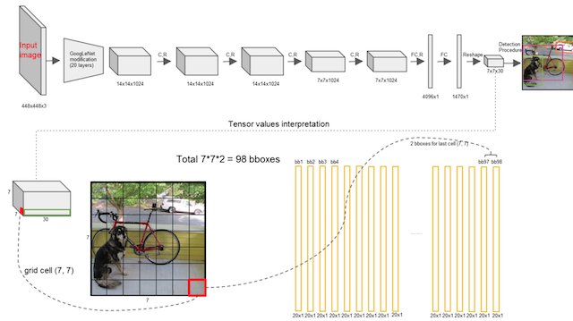
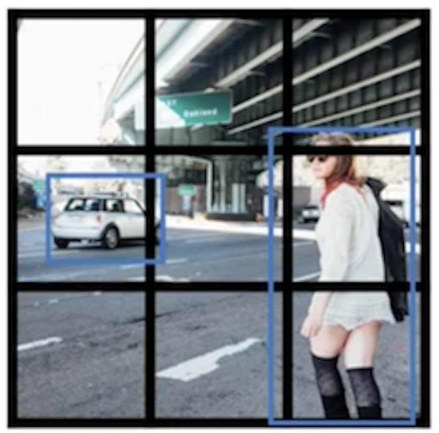
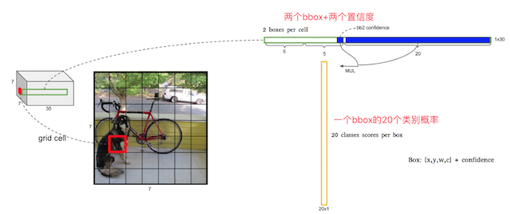
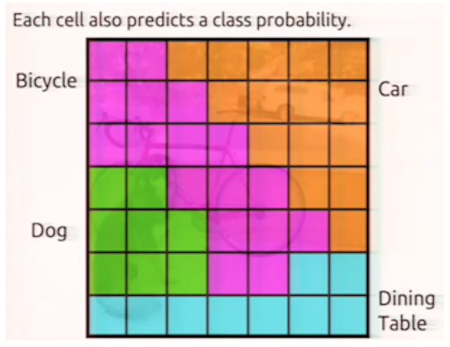
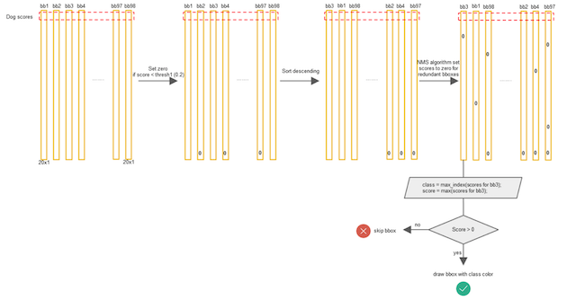
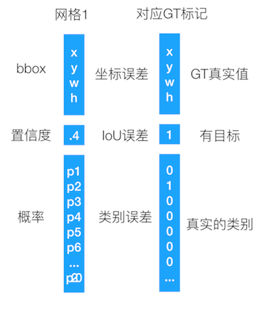
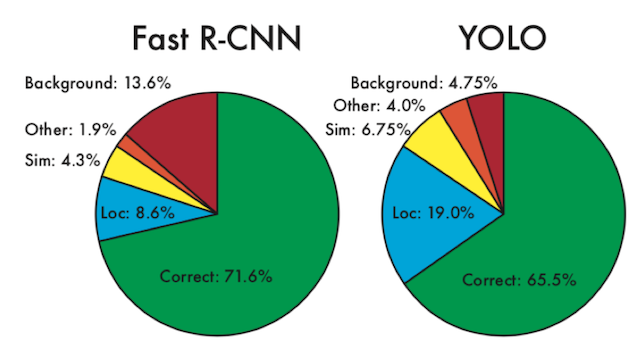

# 3.6 YOLO(You only look once)

### 学习目标

- 目标
  - 知道YOLO的网络结构
  - 知道单元格的意义
  - 知道YOLO的损失
- 应用
  - 无

在正式介绍YOLO之前，我们来看一张图：

可以看出YOLO的最大特点是速度快。

### 3.6.1 YOLO

#### 3.6.1.1 结构

一个网络搞定一切，GoogleNet + 4个卷积+2个全连接层

#### 3.6.1.2 流程理解

* 1、原始图片resize到448x448，经过前面卷积网络之后，将图片输出成了一个7 * 7 * 30的结构

以图示的方式演示

2、默认7 * 7个单元格，这里用3 * 3的单元格图演示

3、每个单元格预测两个bbox框

4、进行NMS筛选,筛选概率以及IoU

### 3.6.2 单元格(grid cell)

最后网络输出的7 * 7 * 30的特征图怎么理解？7 * 7=49个像素值，理解成49个单元格，每个单元格可以代表原图的一个方块。单元格需要做的两件事：

* 1.每个单元格负责预测一个物体类别，并且直接预测物体的概率值

* 2.每个单元格预测两个(默认)bbox位置，两个bbox置信度(confidence)   7 * 7 * 2=98个bbox
  * 30=(4+1+4+1+20), 4个坐标信息，1个置信度(confidence)代表一个bbox的结果， 20代表 20类的预测概率结果

#### 3.6.2.1 网格输出筛选

**一个网格会预测两个Bbox，在训练时我们只有一个Bbox专门负责（一个Object 一个Bbox）**

怎么进行筛选？

* 通过置信度大小比较

**每个bounding box都对应一个confidence score**

* 如果grid cell里面没有object，confidence就是0
* 如果有，则confidence score等于 预测的box和ground truth的IOU乘积

注：**所以如何判断一个grid cell中是否包含object呢？**如果一个object的ground truth的中心点坐标在一个grid cell中，那么这个grid cell就是包含这个object，也就是说这个object的预测就由该grid cell负责。 

这个概率可以理解为不属于任何一个bbox，**而是属于这个单元格所预测的类别**。

* 不同于faster rcnn中的anchors,yolo的框坐标是由网络得出，而faster-rcnn是人为设定一个值，然后利用RPN网络对其优化到一个更准的坐标和是否背景类别

### 3.6.3 非最大抑制(NMS)

每个Bbox的Class-Specific Confidence Score以后，设置阈值，滤掉概率的低的bbox，对每个类别过滤IoU，就得到最终的检测结果

### 3.6.4 训练

* 预测框对应的目标值标记
  * confidence：格子内是否有目标
  * 20类概率：标记每个单元格的目标类别

怎么理解这个过程？同样以分类那种形式来对应，假设以一个单元格的预测值为结果，如下图

* 损失
  * 三部分损失 bbox损失+confidence损失+classfication损失

#### 3.6.5 与Faster R-CNN比较

**Faster R-CNN利用RPN网络与真实值调整了候选区域，然后再进行候选区域和卷积特征结果映射的特征向量的处理来通过与真实值优化网络预测结果。而这两步在YOLO当中合并成了一个步骤，直接网络输出预测结果进行优化。**

所以经常也会称之为YOLO算法为直接回归法代表。YOLO的特点就是快

### 3.6.6 YOLO总结

* 优点
  * 速度快
* 缺点
  * 准确率会打折扣
  * YOLO对相互靠的很近的物体（挨在一起且中点都落在同一个格子上的情况），还有很小的群体检测效果不好，这是因为一个网格中只预测了两个框

### 3.6.7 总结

* YOLO的网络结构
* 输出结果的意义
  * 7 * 7 * 30（用于20类分类）