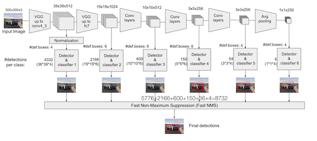
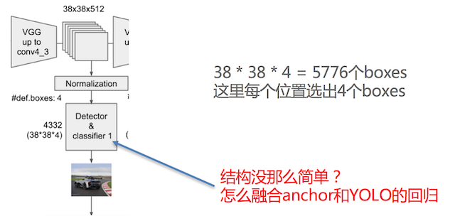
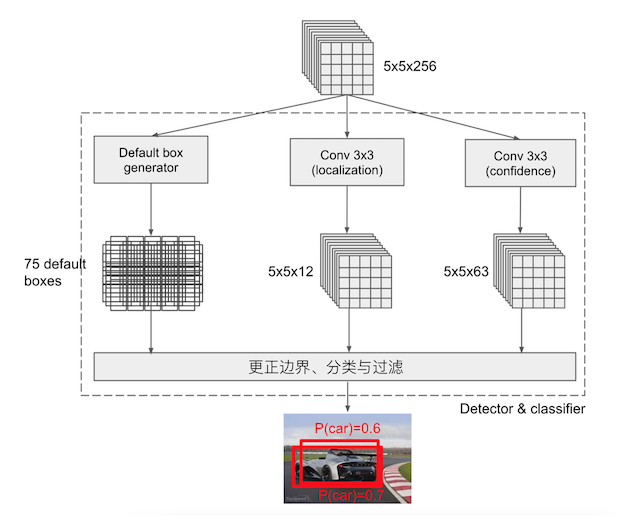
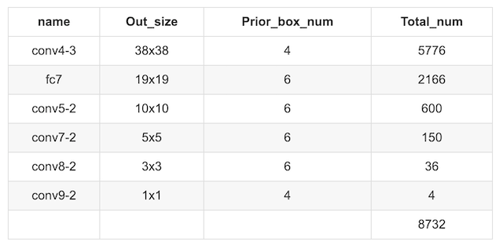
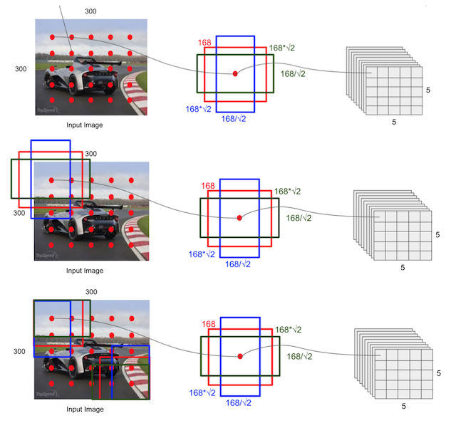
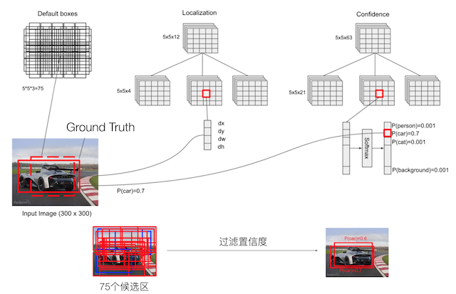
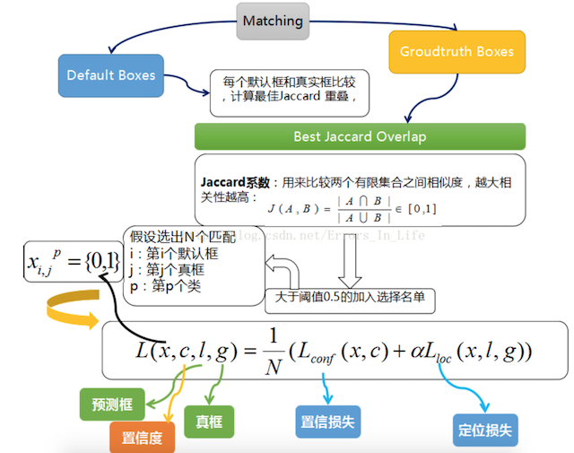
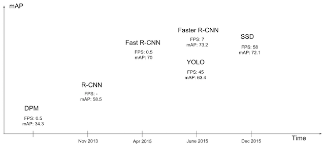

# 3.7 SSD(Single Shot MultiBox Detector)

### 学习目标

- 目标
  - 知道SSD的结构
  - 说明Detector & classifier的作用
  - 说明SSD的优点
- 应用
  - 无

### 3.7.1 SSD

#### 3.7.1.1 简介

SSD算法源于2016年发表的算法论文，论文网址：https://arxiv.org/abs/1512.02325

SSD的特点在于:

* SSD结合了YOLO中的回归思想和Faster-RCNN中的Anchor机制，使用全图各个位置的多尺度区域进行回归，既保持了YOLO速度快的特性，也保证了窗口预测的跟Faster-RCNN一样比较精准。

* SSD的核心是在不同尺度的特征特征图上采用卷积核来预测一系列Default Bounding Boxes的类别、坐标偏移。

#### 3.7.1.2 结构

以VGG-16为基础，使用VGG的前五个卷积，后面增加从CONV6开始的5个卷积结构，输入图片要求300*300。


#### 3.7.1.3 流程



SSD中引入了Defalut Box，实际上与Faster R-CNN的anchor box机制类似，就是预设一些目标预选框，不同的是在**不同尺度feature map所有特征点上使用PriorBox层**

#### 3.7.1.4 Detector & classifier



Detector & classifier的三个部分：

* 1.PriorBox层：生成default boxes，默认候选框

* 2.Conv3 x 3:生成localization， 4个位置偏移

* 3.Conv3 x 3:confidence，21个类别置信度(要区分出背景)



##### 3.7.1.4.1 PriorBox层-default boxes

default boxex类似于RPN当中的滑动窗口生成的候选框，SSD中也是对特征图中的每一个像素生成若干个框。



* 特点分析：
  * priorbox：相当于faster rcnn里的anchors，预设一些box，网络根据box，通过分类和回归给出被检测到物体的类别和位置。每个window都会被分类，并回归到一个更准的位置和尺寸上
  * 各个feature map层经过**priorBox**层生成**prior box**



根据输入的不同aspect ratio 和 scale 以及 num_prior来返回特定的default box，

* default box 的数目是feature map的height x width x num_prior。


```python
1、SSD网络prior_box:打印出来的形状为：
Tensor("concat_2:0", shape=(?, 7308, 8), dtype=float32)


2、variance: bounding regression中的权重。网络输出[dxmin，dymin，dxmax，dymax]，即对应利用如下方法进行针对prior box的位置回归：
decode_bbox->set_xmin(
     prior_bbox.xmin() + prior_variance[0] * bbox.xmin() * prior_width);
 decode_bbox->set_ymin(
     prior_bbox.ymin() + prior_variance[1] * bbox.ymin() * prior_height);
 decode_bbox->set_xmax(
     prior_bbox.xmax() + prior_variance[2] * bbox.xmax() * prior_width);
 decode_bbox->set_ymax(
     prior_bbox.ymax() + prior_variance[3] * bbox.ymax() * prior_height); 
 
# 其中某一层的结构输出
 layer {
  name: "conv6_2_mbox_priorbox"
  type: "PriorBox"
  bottom: "conv6_2"
  bottom: "data"
  top: "conv6_2_mbox_priorbox"
  prior_box_param {
    min_size: 111.0
    max_size: 162.0
    aspect_ratio: 2.0
    aspect_ratio: 3.0
    flip: true
    clip: false
    variance: 0.10000000149
    variance: 0.10000000149
    variance: 0.20000000298
    variance: 0.20000000298
    step: 32.0
    offset: 0.5
}
```

##### 3.7.1.4.2 localization与confidence

这两者的意义如下，主要作用用来过滤，训练



模型中打印出最后的三个部分结果：

```python
Tensor("Reshape_42:0", shape=(?, 7308, 4), dtype=float32) Tensor("truediv:0", shape=(?, 7308, 21), dtype=float32) Tensor("concat_2:0", shape=(?, 7308, 8), dtype=float32)
```

### 问题：SSD中的多个Detector & classifier有什么作用？

SSD的核心是在不同尺度的特征图上来进行Detector & classifier 容易使得SSD观察到更小的物体

### 3.7.2 训练与测试流程

#### 3.7.2.1 train流程

*  输入->输出->结果与ground truth标记样本回归损失计算->反向传播, 更新权值

#### 1. 样本标记：

先将prior box与ground truth box做匹配进行标记正负样本,每次并不训练8732张计算好的default boxes, **先进行置信度筛选，并且训练指定的正样本和负样本,** 如下规则

* 正样本
  * 1.与GT重合最高的boxes, 其输出对应label设为对应物体. 
  * 2.物体GT与anchor iou满足大于0.5

* 负样本：其它的样本标记为负样本

**在训练时, default boxes按照正负样本控制positive：negative=1：3**

#### 3. 损失

网络输出预测的predict box与ground truth回归变换之间的损失计算， 置信度是采用 Softmax Loss(Faster R-CNN是log loss)，位置回归则是采用 Smooth L1 loss (与Faster R-CNN一样) 



#### 3.7.2.2 test流程

* 输入->输出->nms->输出

### 3.7.3 比较




从图中看出SSD算法有较高的准确率和性能，兼顾了**速度和精度**

### 3.7.4 总结

* SSD的结构
* Detector & classifier的组成部分以及作用
* SSD的训练样本标记
* GT与default boxes的格式转换过程


