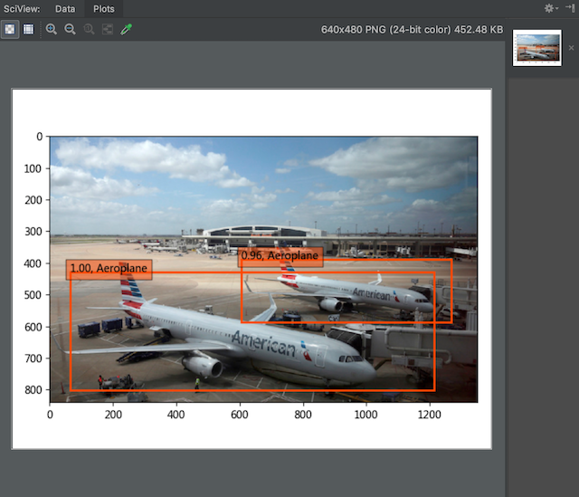
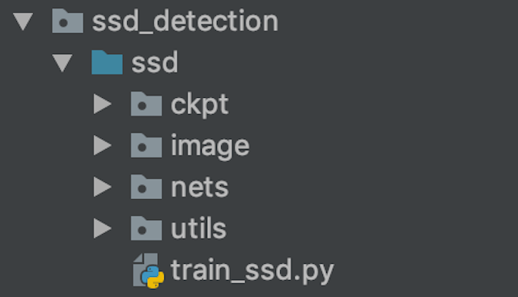

# 4.3 案例：SSD进行物体检测

### 学习目标

- 目标
  - 无
- 应用
  - 应用keras SSD进行物体检测案例

## 4.3.1 案例效果

我们使用已经训练过的模型进行加载之后，总共基础训练时有动物、载具等等共20个物体类别的训练集。一下是对没有训练过的图像的检测结果



## 4.3.2 案例需求

使用开源的SSD网络结构进行检测的是的代码编写，由于开源代码使用 keras 编写，没有tf.keras版本，需要下载 keras-1.2.2 包

```
pip install keras==1.2.2
```

* 使用SSD网络模型，输入图片数据，处理图片数据
* 得到**预测的类别和预测的位置**
* 在图片中显示出来

## 4.3.3 步骤分析以及代码

* 代码结构：
  * ckpt:模型参数保存目录
  * image:测试图片
  * nets:模型网络路径
  * utils:公共组件（模型工具，BBox处理）



* 定义好类别数量以及输出

```python
class SSDTrain(object):

    def __init__(self):

        self.classes_name = ['Aeroplane', 'Bicycle', 'Bird', 'Boat', 'Bottle',
                               'Bus', 'Car', 'Cat', 'Chair', 'Cow', 'Diningtable',
                               'Dog', 'Horse', 'Motorbike', 'Person', 'Pottedplant',
                               'Sheep', 'Sofa', 'Train', 'Tvmonitor']

        self.classes_nums = len(self.classes_name) + 1
        self.input_shape = (300, 300, 3)
```

#### 模型预测流程

* SSD300模型输入以及加载参数
* 读取多个本地路径测试图片，preprocess_input以及保存图像像素值（显示需要）
* 模型预测结果，得到7308个priorbox
* 进行非最大抑制算法处理

* SSD300模型输入以及加载参数

  * by_name:按照每一层名字进行填充参数

  * ```
    If `by_name` is True, weights are loaded into layers
    only if they share the same name. This is useful
    for fine-tuning or transfer-learning models where
    some of the layers have changed.
    ```

```python
model = SSD300(self.input_shape, num_classes=self.classes_nums)

model.load_weights('./ckpt/weights_SSD300.hdf5', by_name=True)
```

* 读取多个本地路径测试图片，preprocess_input以及保存图像像素值（显示需要）

需要使用

```python
from keras.applications.imagenet_utils import preprocess_input
from keras.preprocessing.image import load_img, img_to_array

from scipy.misc import imread
import os

from nets.ssd_net import SSD300
from utils.ssd_utils import BBoxUtility
```

代码：

```python
# 循环读取图片进行多个图片输出检测
feature = []
images = []
for pic_name in os.listdir("./image/"):
    img_path = os.path.join("./image/", pic_name)
    print(img_path)
    # 读取图片
    # 转换成数组
    # 模型输入
    img = load_img(img_path, target_size=(self.input_shape[0], self.input_shape[1]))
    img = img_to_array(img)
    feature.append(img)

    images.append(imread(img_path))
    # 处理图片数据,ndarray数组输入
    inputs = preprocess_input(np.array(feature))
```

* 模型预测结果，得到priorbox

```python
# 预测
preds = model.predict(inputs, batch_size=1, verbose=1)
```

* 进行非最大抑制算法处理

```python
# 定义BBox工具
bbox_util = BBoxUtility(self.classes_nums)
# 使用非最大抑制算法过滤
results = bbox_util.detection_out(preds)
print(results[0].shape, results[1].shape)
```

#### 图片的检测结果显示

需要下载图像显示库

```python
pip install matplotlib
```

* 对结果进行标记

  * 对每张图片的中的物体的6个信息进行获取

* 1、先获取每张图片6列中的结果

```python
for i, img in enumerate(images_data):

    # 通过i获取图片label, location, xmin, ymin, xmax, ymax
    pre_label = outputs[i][:, 0]
    pre_conf = outputs[i][:, 1]
    pre_xmin = outputs[i][:, 2]
    pre_ymin = outputs[i][:, 3]
    pre_xmax = outputs[i][:, 4]
    pre_ymax = outputs[i][:, 5]
    print("label:{}, probability:{}, xmin:{}, ymin:{}, xmax:{}, ymax:{}".
                  format(pre_label, pre_conf, pre_xmin, pre_ymin, pre_xmax, pre_ymax))
```

* 2、过滤预测框到指定类别的概率小的 prior box

```python
top_indices = [i for i, conf in enumerate(pre_conf) if conf >= 0.6]
top_conf = pre_conf[top_indices]
top_label_indices = pre_label[top_indices].tolist()
top_xmin = pre_xmin[top_indices]
top_ymin = pre_ymin[top_indices]
top_xmax = pre_xmax[top_indices]
top_ymax = pre_ymax[top_indices]

# print("pre_label:{}, pre_loc:{}, pre_xmin:{}, pre_ymin:{},pre_xmax:{},pre_ymax:{}".
            #       format(tag_label, tag_loc, tag_xmin, tag_ymin, tag_xmax, tag_ymax))
```

### 完整代码

```python
    def tag_picture(self, images, results):
        """
        对图片预测结果画图显示
        :param images:
        :param results:
        :return:
        """

        for i, img in enumerate(images):
            # 解析输出结果,每张图片的标签，置信度和位置
            pre_label = results[i][:, 0]
            pre_conf = results[i][:, 1]
            pre_xmin = results[i][:, 2]
            pre_ymin = results[i][:, 3]
            pre_xmax = results[i][:, 4]
            pre_ymax = results[i][:, 5]
            print("label:{}, probability:{}, xmin:{}, ymin:{}, xmax:{}, ymax:{}".
                  format(pre_label, pre_conf, pre_xmin, pre_ymin, pre_xmax, pre_ymax))

            # 过滤置信度低的结果
            top_indices = [i for i, conf in enumerate(pre_conf) if conf >= 0.6]
            top_conf = pre_conf[top_indices]
            top_label_indices = pre_label[top_indices].tolist()
            top_xmin = pre_xmin[top_indices]
            top_ymin = pre_ymin[top_indices]
            top_xmax = pre_xmax[top_indices]
            top_ymax = pre_ymax[top_indices]

            # 定义21中颜色，显示图片
            # currentAxis增加图中文本显示和标记显示
            colors = plt.cm.hsv(np.linspace(0, 1, 21)).tolist()
            plt.imshow(img / 255.)
            currentAxis = plt.gca()

            for i in range(top_conf.shape[0]):
                xmin = int(round(top_xmin[i] * img.shape[1]))
                ymin = int(round(top_ymin[i] * img.shape[0]))
                xmax = int(round(top_xmax[i] * img.shape[1]))
                ymax = int(round(top_ymax[i] * img.shape[0]))

                # 获取该图片预测概率，名称，定义显示颜色
                score = top_conf[i]
                label = int(top_label_indices[i])
                label_name = self.classes_name[label - 1]
                display_txt = '{:0.2f}, {}'.format(score, label_name)
                coords = (xmin, ymin), xmax - xmin + 1, ymax - ymin + 1
                color = colors[label]
                # 显示方框
                currentAxis.add_patch(plt.Rectangle(*coords, fill=False, edgecolor=color, linewidth=2))
                # 左上角显示概率以及名称
                currentAxis.text(xmin, ymin, display_txt, bbox={'facecolor': color, 'alpha': 0.5})

            plt.show()
```


