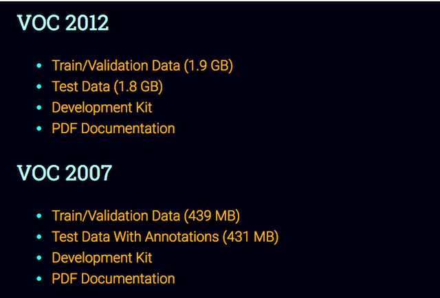
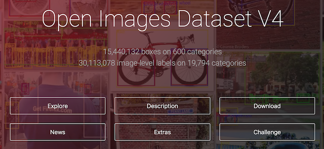
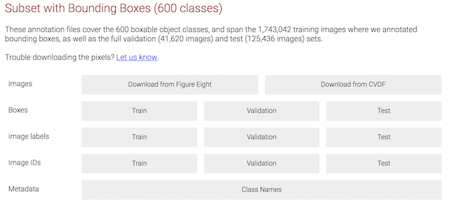
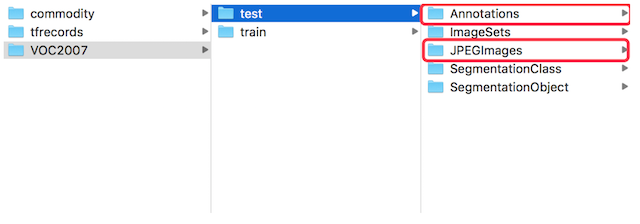
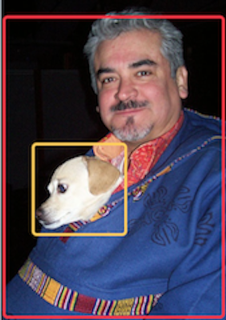
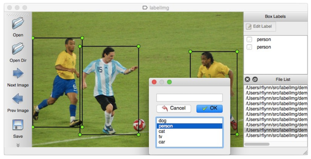

# 6.1 目标检测数据集

### 学习目标

- 目标
  - 了解常用目标检测数据集
  - 了解数据集构成
  - 了解数据集标记的需求

  - 知道labelimg的标记使用
- 应用

  - 应用labelimg完成商品数据集的标记

## 6.1.1 常用目标检测数据集

* **pascal Visual Object Classes**


VOC数据集是目标检测经常用的一个数据集,从05年到12年都会举办比赛（比赛有task： Classification、Detection、Segmentation、PersonLayout）,主要由VOC2007和VOC2012两个数据集



> 注：
>
> 官网地址：http://host.robots.ox.ac.uk/pascal/VOC/
>
> 下载地址：https://pjreddie.com/projects/pascal-voc-dataset-mirror/

* **Open Images Dataset V4**



2018年发布了包含在 190 万张图片上针对 600 个类别的 1540 万个边框盒，**这也是现有最大的具有对象位置注释的数据集**。这些边框盒大部分都是由专业注释人员手动绘制的，确保了它们的准确性和一致性。



谷歌的数据集类目较多涵盖范围广，但是文件过多，处理起来比较麻烦，所以选择目前使用较多并且已经成熟的pascavoc数据集

## 6.1.2 pascal voc数据集介绍

通常使用较多的为VOC2007数据集，总共9963张图片，需要判定的总物体类别数量为20个对象类别是：

- *人：*人
- *动物：*鸟，猫，牛，狗，马，羊
- *车辆：*飞机，自行车，船，公共汽车，汽车，摩托车，火车
- *室内：*瓶子，椅子，餐桌，盆栽，沙发，电视/显示器


* 文件结构



* 文件内容
  * Annotations: **图像中的目标标注信息xml格式**
  * JPEGImages:**所有图片（VOC2007中总共有9963张，训练有5011张，测试有4952张）**


## 6.1.3 XML

以下是一个标准的物体检测标记结果格式，这就是用于训练的物体标记结果。其中有几个重点内容是后续在处理图像标记结果需要关注的。

* size:
  * 图片尺寸大小，宽、高、通道数
* object:
  * name:被标记物体的名称
  * bndbox:标记物体的框大小

如下例子：为000001.jpg这张图片，其中有两个物体被标记



```xml
<annotation>
	<folder>VOC2007</folder>
	<filename>000001.jpg</filename># 文件名
	<source># 文件来源
		<database>The VOC2007 Database</database>
		<annotation>PASCAL VOC2007</annotation>
		<image>flickr</image>
		<flickrid>341012865</flickrid>
	</source>
	<owner>
		<flickrid>Fried Camels</flickrid>
		<name>Jinky the Fruit Bat</name>
	</owner>
	<size># 文件尺寸，包括宽、高、通道数
		<width>353</width>
		<height>500</height>
		<depth>3</depth>
	</size>
	<segmented>0</segmented># 是否用于目标分割
	<object># 真实标记的物体
		<name>dog</name># 目标类别名称
		<pose>Left</pose>
		<truncated>1</truncated># 是否截断，这个目标因为各种原因没有被框完整（被截断了），比如说一辆车有一部分在画外面
		<difficult>0</difficult># 表明这个待检测目标很难识别，有可能是虽然视觉上很清楚，但是没有上下文的话还是很难确认它属于哪个分类，标为difficult的目标在测试评估中一般会被忽略
		<bndbox># bounding-box
			<xmin>48</xmin>
			<ymin>240</ymin>
			<xmax>195</xmax>
			<ymax>371</ymax>
		</bndbox>
	</object>
	<object># 真实标记的第二个物体
		<name>person</name>
		<pose>Left</pose>
		<truncated>1</truncated>
		<difficult>0</difficult>
		<bndbox>
			<xmin>8</xmin>
			<ymin>12</ymin>
			<xmax>352</xmax>
			<ymax>498</ymax>
		</bndbox>
	</object>
</annotation>
```

#### 为什么要进行数据集标记呢？

1、提供给训练的数据样本，图片和目标真是实结果

2、特定的场景都会缺少标记图片

## 6.1.4 数据集标记工具介绍

### 6.1.4.1 介绍

LabelImg是一个图形图像注释工具。它是用Python编写的，并使用Qt作为其图形界面。注释以PASCAL VOC格式保存为XML文件，这是ImageNet使用的格式。



> 注：官网：https://github.com/tzutalin/labelImg

### 6.1.4.2 安装

官网给出了不同平台的安装教程，由于教程过于粗略。安装细节参考安装教程本地文件


- 参考本地文件：
  

## 6.1.5 商品数据集标记

在这里我们只是体验标记的过程，那么对于标记这个费时费力的工作，一般会有专门的数据标记团队去做，也称之为打标签，标记师。特别是缺乏具体应用场景的训练数据的时候。

### 6.1.5.1 需求介绍

首先在确定标记之前的需求，本项目以商品数据为例，需要明确的有

- 1、商品图片
- 2、需要被标记物体有哪些

我们确定了8种类别的商品（如需更细致，可将类别商品扩大），如下图


### 6.1.5.2 标记

使用lableimg进行商品数据集标记

- 运行labelimg

```bash
python labelImg.py
```


打开如下结果


- 对图片中的物体进行标记

标记原则为图片中所出现的物体与我们确定的8个类别物体相匹配即可


- 按下ctrl+s键保存，软件将会保存为默认XML文件格式**(XML文件名与图片文件名保持一致方便后续处理)**


其中关于(xmin,ymin,xmax,ymax)我们已经解释过，可通过软件标记的时候观察是否一致

### 6.1.6 总结

- 掌握labelimg的标注使用