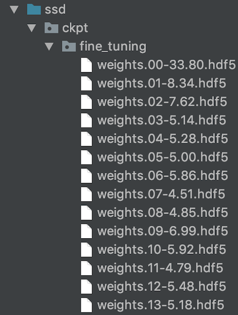

# 6.4 训练

### 学习目标

- 目标
  - 无
- 应用
  - 应用API完成商品数据集的训练过程

## 6.4.1 案例训练结果

* 文件



## 6.4.2 案例思路

* image_generator：获取图片数据标注数据生成器
  * 标注数据分割

```python
from utils.detection_generate import Generator
```

* 初始化模型参数以及冻结部分结构
* compile与fit_generator

### 6.4.2.1 获取Generator

* class Generator(object):
      def __init__(self, gt, bbox_util,
                   batch_size, path_prefix,
                   train_keys, val_keys, image_size,
                   saturation_var=0.5,
                   brightness_var=0.5,
                   contrast_var=0.5,
                   lighting_std=0.5,
                   hflip_prob=0.5,
                   vflip_prob=0.5,
                   do_crop=True,
                   crop_area_range=[0.75, 1.0],
                   aspect_ratio_range=[3. / 4., 4. / 3.]):
  * gt:groundtruth结果
  * bbox_util：解码工具，priors: Priors and variances, numpy tensor of shape (num_priors, 8),
                priors[i] = [xmin, ymin, xmax, ymax, varxc, varyc, varw, varh].
  * batch_size:批处理大小
  * path_frefix: 图片的路径
  * train_keys：训练图片名字列表
  * val_keys：测试图片名字列表

导入工具

```python
from utils.detection_generate import Generator
from utils.ssd_utils import BBoxUtility
from nets.ssd_net import SSD300

import numpy as np
import pickle
```

定义类，进行初始化网络基础参数

```python
class SSDTrain(object):

    def __init__(self, num_classes=9, input_shape=(300, 300, 3), epoch=50):
        self.num_classes = num_classes
        self.input_shape = input_shape
        self.epoch = epoch

        # prior box读取工具，初始化网络中prior boxes 配置
        priors = pickle.load(open('./datasets/prior_boxes_ssd300.pkl', 'rb'))
        self.bbox_util = BBoxUtility(self.num_classes, priors)

        self.path_prefix = './datasets/commodity/JPEGImages/'

        self.model = SSD300(self.input_shape, num_classes=self.num_classes)

    def image_generator(self):

        # 获取标记数据，分成训练集与测试集
        gt = pickle.load(open('./datasets/commodity_gt.pkl', 'rb'))
        keys = sorted(gt.keys())
        num_train = int(round(0.8 * len(keys)))
        train_keys = keys[:num_train]
        val_keys = keys[num_train:]

        # Generator获取数据
        gen = Generator(gt, self.bbox_util, 16, self.path_prefix,
                        train_keys, val_keys,
                        (self.input_shape[0], self.input_shape[1]), do_crop=False)
```

###6.4.2.3 初始化网络参数，微调网络

进行模型参数加载以及模型的结构freeze

```python
    def init_model_param(self):
        """
        初始化模型参数
        :return:
        """

        self.model.load_weights('./ckpt/pre_trained/weights_SSD300.hdf5', by_name=True)

        # 选择freeze部分结构
        freeze = ['input_1', 'conv1_1', 'conv1_2', 'pool1',
                  'conv2_1', 'conv2_2', 'pool2',
                  'conv3_1', 'conv3_2', 'conv3_3', 'pool3']
        for L in self.model.layers:
            if L.name in freeze:
                L.trainable = False
```

###6.4.2.4 设置训练参数以及fit

* 使用adam默认算法

需要导入相关库，计算损失

```python
from utils.ssd_losses import MultiboxLoss
```

MultiboxLoss的计算：多个priorbox的损失值计算
```python
    def compile(self):
        """
        配置训练参数
        :return:
        """
		# MultiboxLoss:N个类别+1背景类别
        # TensorFlow.python.keras.optimizers.Adam() 出现问题
        # keras 1.2.2 optimizers.Adam()  这个版本的函数可以
        optimizer = keras.optimizers.Adam()
        self.model.compile(optimizer=optimizer,
                           loss=MultiboxLoss(self.num_classes, neg_pos_ratio=2.0).compute_loss)

    def fit_generator(self, gen):
        """
        训练
        :param gen: 图片数据生成器
        :return:
        """
        # 配置回调
        callbacks = [
            keras.callbacks.ModelCheckpoint('./ckpt/fine_tuning/weights.{epoch:02d}-{val_acc:.2f}.hdf5',monitor='val_acc',
                                                     save_weights_only=True,
                                                     save_best_only=True,
                                                     mode='auto',
                                                     period=1),keras.callbacks.TensorBoard(log_dir='./graph', histogram_freq=1,
                                                      write_graph=True, write_images=True)]
        self.model.fit_generator(gen.generate(True), gen.train_batches,
                                 self.epoch, verbose=1,
                                 callbacks=callbacks,
                                 validation_data=gen.generate(False),
                                 nb_val_samples=gen.val_batches)
```

## 6.4.3 多GPU训练代码修改

* **在tf.keras中直接使用DistributionStrategy**

```python
    def compile(self):
        """
        配置训练参数
        :return:
        """
        distribution = tf.contrib.distribute.MirroredStrategy()

        optimizer = keras.optimizers.Adam()
        self.model.compile(optimizer=optimizer,
                           loss=MultiboxLoss(self.num_classes, neg_pos_ratio=2.0).compute_loss,
                           distribution=distribution)
```

## 6.4.4 预测代码

修改源代码self.classes_name的目标个数：按照建立one_hot编码的顺序。

```
self.classes_name = ['clothes', 'pants', 'shoes', 'watch', 'phone',
                     'audio', 'computer', 'books']
```

修改读取训练过后的模型

```python
from tensorflow import keras
from keras.applications.imagenet_utils import preprocess_input
from keras.preprocessing.image import load_img, img_to_array
import matplotlib.pyplot as plt
import numpy as np

from nets.ssd_net import SSD300
from utils.ssd_utils import BBoxUtility
from scipy.misc import imread
import os


class SSDTrain(object):

    def __init__(self):
		
        self.classes_name = ['Aeroplane', 'Bicycle', 'Bird', 'Boat', 'Bottle',
                               'Bus', 'Car', 'Cat', 'Chair', 'Cow', 'Diningtable',
                               'Dog', 'Horse', 'Motorbike', 'Person', 'Pottedplant',
                               'Sheep', 'Sofa', 'Train', 'Tvmonitor']

        self.classes_nums = len(self.classes_name) + 1
        self.input_shape = (300, 300, 3)

    def test(self):

        model = SSD300(self.input_shape, num_classes=self.classes_nums)

        model.load_weights('./ckpt/weights_SSD300.hdf5', by_name=True)

        # 循环读取图片进行多个图片输出检测
        feature = []
        images = []
        for pic_name in os.listdir("./image/"):
            img_path = os.path.join("./image/", pic_name)
            print(img_path)
            # 读取图片
            # 转换成数组
            # 模型输入
            img = load_img(img_path, target_size=(self.input_shape[0], self.input_shape[1]))
            img = img_to_array(img)
            feature.append(img)

            images.append(imread(img_path))
            # 处理图片数据,ndarray数组输入
            inputs = preprocess_input(np.array(feature))
        # 预测
        preds = model.predict(inputs, batch_size=1, verbose=1)
        print(preds)
        # 定义BBox工具
        bbox_util = BBoxUtility(self.classes_nums)
        # 使用非最大抑制算法过滤
        results = bbox_util.detection_out(preds)
        print(results[0].shape, results[1].shape)
        return images, results

    def tag_picture(self, images, results):
        """
        对图片预测结果画图显示
        :param images:
        :param results:
        :return:
        """

        for i, img in enumerate(images):
            # 解析输出结果,每张图片的标签，置信度和位置
            pre_label = results[i][:, 0]
            pre_conf = results[i][:, 1]
            pre_xmin = results[i][:, 2]
            pre_ymin = results[i][:, 3]
            pre_xmax = results[i][:, 4]
            pre_ymax = results[i][:, 5]
            print("label:{}, probability:{}, xmin:{}, ymin:{}, xmax:{}, ymax:{}".
                  format(pre_label, pre_conf, pre_xmin, pre_ymin, pre_xmax, pre_ymax))

            # 过滤置信度低的结果
            top_indices = [i for i, conf in enumerate(pre_conf) if conf >= 0.6]
            top_conf = pre_conf[top_indices]
            top_label_indices = pre_label[top_indices].tolist()
            top_xmin = pre_xmin[top_indices]
            top_ymin = pre_ymin[top_indices]
            top_xmax = pre_xmax[top_indices]
            top_ymax = pre_ymax[top_indices]

            # 定义21中颜色，显示图片
            # currentAxis增加图中文本显示和标记显示
            colors = plt.cm.hsv(np.linspace(0, 1, 21)).tolist()
            plt.imshow(img / 255.)
            currentAxis = plt.gca()

            for i in range(top_conf.shape[0]):
                xmin = int(round(top_xmin[i] * img.shape[1]))
                ymin = int(round(top_ymin[i] * img.shape[0]))
                xmax = int(round(top_xmax[i] * img.shape[1]))
                ymax = int(round(top_ymax[i] * img.shape[0]))

                # 获取该图片预测概率，名称，定义显示颜色
                score = top_conf[i]
                label = int(top_label_indices[i])
                label_name = self.classes_name[label - 1]
                display_txt = '{:0.2f}, {}'.format(score, label_name)
                coords = (xmin, ymin), xmax - xmin + 1, ymax - ymin + 1
                color = colors[label]
                # 显示方框
                currentAxis.add_patch(plt.Rectangle(*coords, fill=False, edgecolor=color, linewidth=2))
                # 左上角显示概率以及名称
                currentAxis.text(xmin, ymin, display_txt, bbox={'facecolor': color, 'alpha': 0.5})

            plt.show()


if __name__ == '__main__':
    ssd = SSDTrain()
    images, results = ssd.test()
    ssd.tag_picture(images, results)
```