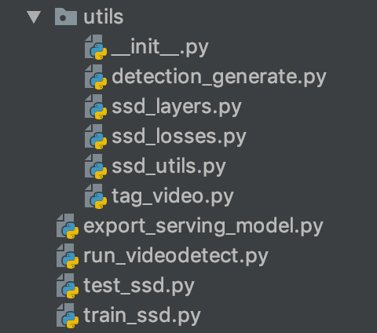
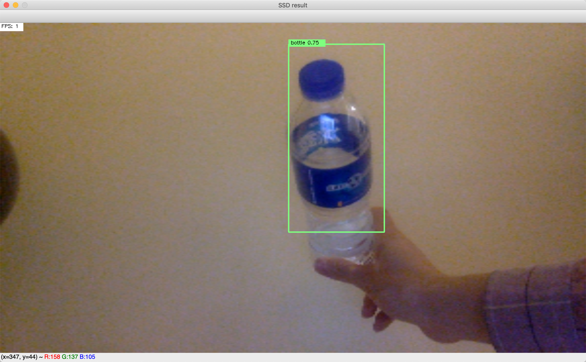

# 6.6 案例：视频物体检测测试

### 学习目标

- 目标
  - 无
- 应用
  - 应用opencv+keras完成视频物体检测测试过程

## 6.6.1 案例结构目录



## 6.6.2 案例效果演示



## 6.6.3 步骤分析

* 配置获取相关预测数据类别，网络参数
* 获取摄像头视频
* 获取摄像每帧数据，进行格式形状处理
* 模型预测、结果NMS过滤
* 画图：显示物体位置，FPS值（每秒帧数）

## 6.6.4 代码实现

导入相关包

```python
import cv2
import keras
from keras.applications.imagenet_utils import preprocess_input
from keras.backend.tensorflow_backend import set_session
from keras.models import Model
from keras.preprocessing import image
import pickle
import numpy as np
from random import shuffle
from scipy.misc import imread, imresize
from timeit import default_timer as timer

from utils.ssd_utils import BBoxUtility
```

* 1、配置获取相关预测数据类别，网络参数

```python
class VideoTag(object):
    """
    """

    def __init__(self, class_names, model, input_shape):
        # 获取
        self.class_names = class_names
        self.num_classes = len(class_names)
        self.model = model
        self.input_shape = input_shape
        self.bbox_util = BBoxUtility(self.num_classes)
```

* 2、获取摄像头视频

```python
    def run(self, video_path=0, conf_thresh=0.6):
        """运行测试
        """

        vid = cv2.VideoCapture(video_path)
        if not vid.isOpened():
            raise IOError(("找不到对应的视频或者摄像头"))
```

* 3、获取摄像每帧数据，进行格式形状处理

```python
# 获取视频或者摄像头内容
        while True:
            retval, orig_image = cap.read()
            if not retval:
                print("视频检测结束!")
                return
            source_image = np.copy(orig_image)

            # 进行输入每帧数据形状修改以及图片的格式修改BGR--->RGB
            im_size = (self.input_shape[0], self.input_shape[1])
            resized = cv2.resize(orig_image, im_size)
            rgb = cv2.cvtColor(resized, cv2.COLOR_BGR2RGB)

            # 将数据转换成原始需要画出的图片
            to_draw = cv2.resize(resized, (int(source_image.shape[1]), int(source_image.shape[0])))
```

* 4、模型预测、结果NMS过滤

```python
# 使用模型进行每帧数据预测
inputs = [image.img_to_array(rgb)]
tmp_inp = np.array(inputs)
x = preprocess_input(tmp_inp)

y = self.model.predict(x)

# 对预测结果进行NMS过滤
results = self.bbox_util.detection_out(y)
```

* 5、画图显示
  * 画出物体位置，给定固定阈值

```python
			# 画图显示
            if len(results) > 0 and len(results[0]) > 0:
                # 获取每个框的位置以及类别概率
                det_label = results[0][:, 0]
                det_conf = results[0][:, 1]
                det_xmin = results[0][:, 2]
                det_ymin = results[0][:, 3]
                det_xmax = results[0][:, 4]
                det_ymax = results[0][:, 5]
                # 过滤概率小的
                top_indices = [i for i, conf in enumerate(det_conf) if conf >= conf_thresh]

                top_conf = det_conf[top_indices]
                top_label_indices = det_label[top_indices].tolist()
                top_xmin = det_xmin[top_indices]
                top_ymin = det_ymin[top_indices]
                top_xmax = det_xmax[top_indices]
                top_ymax = det_ymax[top_indices]

                for i in range(top_conf.shape[0]):
                    xmin = int(round(top_xmin[i] * to_draw.shape[1]))
                    ymin = int(round(top_ymin[i] * to_draw.shape[0]))
                    xmax = int(round(top_xmax[i] * to_draw.shape[1]))
                    ymax = int(round(top_ymax[i] * to_draw.shape[0]))

                    # 对于四个坐标物体框进行画图显示
                    class_num = int(top_label_indices[i])
                    cv2.rectangle(to_draw, (xmin, ymin), (xmax, ymax),
                                  self.class_colors[class_num], 2)
                    text = self.class_names[class_num] + " " + ('%.2f' % top_conf[i])

                    # 文本框进行设置显示
                    text_top = (xmin, ymin - 10)
                    text_bot = (xmin + 80, ymin + 5)
                    text_pos = (xmin + 5, ymin)
                    cv2.rectangle(to_draw, text_top, text_bot, self.class_colors[class_num], -1)
                    cv2.putText(to_draw, text, text_pos, cv2.FONT_HERSHEY_SIMPLEX, 0.35, (0, 0, 0), 1)
```

* 显示FPS参数

```python
			# 计算 FPS显示
            fps = "FPS: " + str(cap.get(cv2.CAP_PROP_FPS))

            # 画出FPS
            cv2.rectangle(to_draw, (0, 0), (50, 17), (255, 255, 255), -1)
            cv2.putText(to_draw, fps, (3, 10), cv2.FONT_HERSHEY_SIMPLEX, 0.35, (0, 0, 0), 1)
```

* 显示图片

```python
			# 显示图片
            cv2.imshow("SSD result", to_draw)
            cv2.waitKey(1)
 # 释放capture资源
cap.release()
cv2.destroyAllWindows()
```

## 6.6.4 调用视频预测

```python
import sys
import keras
from utils.tag_video import VideoTag
from nets.ssd_net import SSD300


def main():

    input_shape = (300, 300, 3)

    # 数据集的配置
    class_names = ["background", "aeroplane", "bicycle", "bird", "boat", "bottle", "bus", "car", "cat", "chair", "cow",
                   "diningtable", "dog", "horse", "motorbike", "person", "pottedplant", "sheep", "sofa", "train",
                   "tvmonitor"]

    NUM_CLASSES = len(class_names)

    model = SSD300(input_shape, num_classes=NUM_CLASSES)

    # 加载模型
    model.load_weights('./ckpt/pre_trained/weights_SSD300.hdf5')

    vid_test = VideoTag(class_names, model, input_shape)

    vid_test.run(0)


if __name__ == '__main__':
    main()
```


