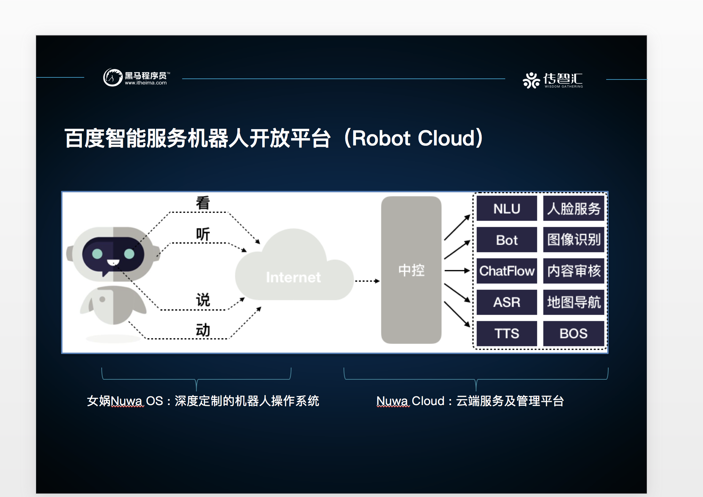
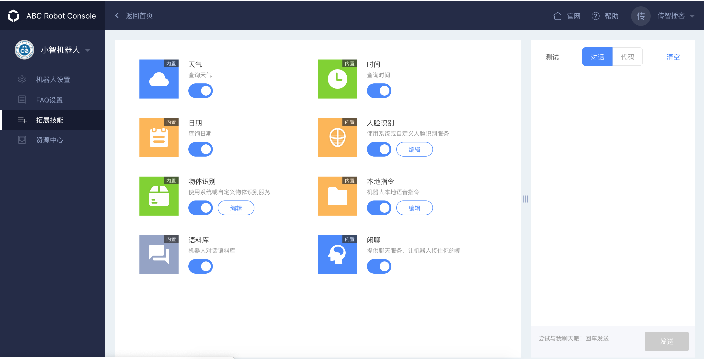
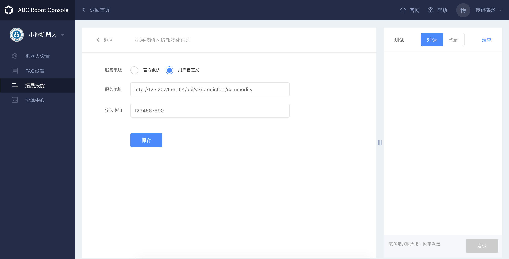

# 7.7 项目接口与百度机器人对接

### 学习目标

- 目标
  - 无
- 应用
  - 无

## 7.7.1 百度服务机器人介绍

* 开放平台架构



* 机器人后台配置网址: https://console.bce.baidu.com/abcrobot/#/consolePage/extAbility/objIdentify
  - 需要企业百度云账号，这里做演示说明
  - 机器人配置后台



* 配置自定义物体识别功能

  * 配置页面
  * 其中需要配置我们自己的物体识别HTTP接口，密钥可以随意配置

  

## 7.7.2 接口对接百度修改

* 参考百度人脸、物体识别协议

### 7.7.2.1 web对接口

```python
from flask import Flask
from flask import request, abort, send_file, render_template, jsonify
import base64
from urllib import parse

@app.route("/api/v3/prediction/commodity", methods=['POST'])
def commodity_predict_itcast():
    """
    百度机器人对接接口
    """
    # 百度机器人平台传入参数解析
    req = request.get_json()
    requestId = req["requestId"]
    img_str = req["image"]
    # 传入的image_str进行解码gbk编码形式
    img_str = parse.unquote(img_str)
    # str编码utf-8之后进行base64解码
    img = base64.b64decode(img_str.encode())
    # 预测结果标记，不标记图片直接返回预测结果，百度平台识别处理
    # 通过i获取图片label, location, xmin, ymin, xmax, ymax
    # pre_label = outputs[0][:, 0]
    # pre_conf = outputs[0][:, 1]
    # pre_xmin = outputs[0][:, 2]
    # pre_ymin = outputs[0][:, 3]
    # pre_xmax = outputs[0][:, 4]
    # pre_ymax = outputs[0][:, 5]
    y_predict = make_prediction_v2(img)
    # 预测结果返回参数封装
    resp = {
	"result":[]
    }
    for i in range(outputs[0][:, 1].shape[0]):
        resp["result"].append({"score":float(outputs[0][:, 1][i]), "root":"", "keyword":VOC_LABELS[str(outputs[0][:, 0][i])]})
    resp["extInfos"] = {}
    resp["filterThreshold"] = 0.7
    resp["resultNum"] = outputs[0][:, 1].shape[0]
    resp["requestId"] = requestId
    print(resp)
    return jsonify(resp)
```

* 对应的预测结果进行最后输出修改

```python
def make_prediction_v2(image):
    """
    对于前端传入的参数进行预测
    :return:
    """
    # - 1、获取读取后台读取的图片
    def resize_img(image, input_size):
        img = io.BytesIO()
        img.write(image)
        # 使用pillow image 接收这个图片
        rgb = Image.open(img).convert('RGB')

        # 换砖大小
        if input_size:
            rgb = rgb.resize((input_size[0], input_size[1]))

        return rgb

    # - 2、图片大小处理，转换数组
    resize = resize_img(image, (300, 300))
    image_array = img_to_array(resize)
    # 3---> 4维度
    image_tensor = preprocess_input(np.array([image_array]))

    # - 3、打开通道channel, 构建stub，预测结果， predict_pb2进行预测请求创建
    # 8500:grpc 8501:http
    with grpc.insecure_channel("127.0.0.1:8500") as channel:
        # stub通道
        stub = prediction_service_pb2_grpc.PredictionServiceStub(channel)

        # 构造请求 tensorflow serving请求格式
        request = predict_pb2.PredictRequest()
        request.model_spec.name = 'commodity'
        # 默认签名即可
        request.model_spec.signature_name = signature_constants.DEFAULT_SERVING_SIGNATURE_DEF_KEY
        request.inputs['images'].CopyFrom(tf.contrib.util.make_tensor_proto(image_tensor, shape=[1, 300, 300, 3]))

        # 与模型服务进行请求获取预测结果
        # 模型服务的request {'concat_3:0': tensor类}
        results = stub.Predict(request)

        # 会话去解析模型服务返回的结果
        with tf.Session() as sess:

            _res = sess.run(tf.convert_to_tensor(results.outputs['concat_3:0']))

            # 进行预测结果的NMS过滤
            # 物体检测的类别数量8 + 1
            bbox = BBoxUtility(9)
            y_predict = bbox.detection_out(_res)

    return y_predict
```


